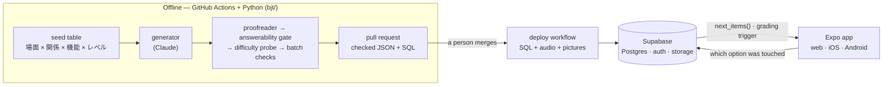
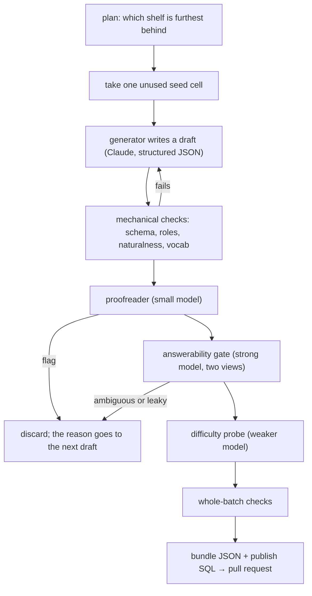

<h1 align="center">ビジネス日本語ドリル</h1>

<p align="center">
  <strong>An adaptive practice app for the BJT Business Japanese Proficiency Test — and the LLM pipeline that writes, checks, and grades its questions.</strong>
</p>

<p align="center">
  
  
  
  
  
  
  
</p>

> **Work in progress, and not open.** A personal project, built by one person to
> prepare for the BJT. It is readable here because there is no reason to hide
> it, not because it is finished or because anybody can sign up: only
> addresses on a tester list can even create an account. See
> [blockers.md](blockers.md) for what stands between this and a launch, and
> [LICENSE](LICENSE) for what you may do with what is here.

This document explains the whole system from the top down, so that someone who
reads it end to end understands what the app does and why, without opening the
code. It starts with **what** it is, then **how it runs**, then goes part by
part: what a learner sees, what a question is, how questions are made, how they
ship, and how the database decides what each person is served. The last part is
for working on it.

**Contents**

1. [What it is](#1-what-it-is)
2. [How it runs](#2-how-it-runs)
3. [The app, as a learner meets it](#3-the-app-as-a-learner-meets-it)
4. [The questions](#4-the-questions)
5. [How a question is made](#5-how-a-question-is-made)
6. [How questions ship: the nightly job and deployment](#6-how-questions-ship-the-nightly-job-and-deployment)
7. [The database: how the app decides](#7-the-database-how-the-app-decides)
8. [Working on it](#8-working-on-it)

---

## 1. What it is

**ビジネス日本語ドリル** ("Business Japanese Drill") is a study app for the
format of the **BJT ビジネス日本語能力テスト** (Business Japanese Proficiency
Test), plus the machinery that writes its questions.

The BJT is a listening-and-reading exam about Japanese at work: phone calls,
meetings, emails, notices, schedules, and above all whether what you say fits
who you are saying it to. It has 80 questions in three sections — **聴解**
(listening), **聴読解** (listening while reading a document) and **読解**
(reading) — and reports a result per section.

The app is used like this: a learner opens it, presses one button, and answers
a set of about ten questions — about five minutes a day. After each answer it
shows what went wrong and why, in the terms the exam cares about (「you used
honorific language about your own boss to a client」, not just 「wrong」). Over
days it works out the learner's level in each section, keeps bringing back the
traps that caught them in new questions, and aims each question at the right
difficulty. **The learner never chooses anything about the questions** — no
level, section, type or mode. The app's whole job is to raise a score, and
choosing well is the part a person is worst at.

Every question is an **original composition**: no past-paper text is ever used.
They are written by a large language model (Claude) **offline, in a nightly
batch job** — never while someone is practising — then checked by several other
models and by fixed rules, and finally read by a person before they ship.

### The ideas that shape everything

* **Nothing is generated while somebody is practising.** Generation is a batch
  job, and what ships is checked data, published as reviewable SQL. Practice
  costs nothing to serve, and the quality gates can afford to be slow.
* **One bank, shared by everybody, sorted per person.** Every learner draws from
  the same published library of questions; what is personal is the *order*,
  decided by fixed, readable SQL over labels attached to each question before
  it shipped.
* **The level is per exam section.** A learner can be J1 (hardest) at reading
  and J3 (easiest) at listening at the same time — most people are.
* **Good at something means harder questions in it.** Inside a level, the queue
  aims each question at a difficulty that follows the learner's accuracy at
  that kind of question.
* **A mistake is a lesson, and a lesson comes back as a new question.** The app
  remembers *which trap* caught you and later tests it again in a situation you
  have not seen, rather than showing you the same question until you memorise
  "it was 3".
* **The database grades answers, not the app.** The app only reports which
  option was touched; the database decides whether it was right and which trap
  caught the learner.
* **No invented numbers.** There is no estimated exam score anywhere, because
  generated questions have no calibration that could honestly produce one.

### At a glance

| | |
|---|---|
| 🎯 **Coverage** | All **9** problem types of the BJT's three sections (聴解 · 聴読解 · 読解), plus a rare picture type (画像把握), at three levels (J3 / J2 / J1) |
| 🧠 **Adaptive, with nothing to set** | One button. Per-section levels, a spaced-repetition ladder, and a difficulty target that follows you — all computed in SQL |
| 🤖 **LLM-generated, gate-checked** | Every generated item passes a proofreader, a two-sided answerability gate, a difficulty probe and batch-level checks before it can ship |
| 🗓️ **Offline by design** | A nightly GitHub Action writes a few checked items (at most $0.50 a night) and opens a pull request; merging it ships them |
| 🔊 **Real listening practice** | Role-cast synthetic voices, phone-line audio treatment, and spoken options for every 聴解 item |
| 🔒 **The database is the gatekeeper** | Testers only, enforced by row-level security on every table; answers are graded by a Postgres trigger |

---

## 2. How it runs

### The three parts

The system is three programs that never talk to each other directly. They meet
in the database.



1. **The item pipeline** (`bjt/`, Python). Writes questions with Claude, checks
   them with other models and fixed rules, and turns the survivors into
   **bundles** (JSON files) and the **SQL** that publishes them. It also makes
   the audio (text-to-speech) and pictures. It runs on a laptop or in GitHub
   Actions, never behind the app.
2. **The database** (`supabase/`, Postgres on Supabase). Holds the published
   question bank, every learner's answers, and the logic that matters at
   practice time: the function that builds each person's next set
   (`next_items()`), the trigger that grades each answer, the rules that move a
   learner's level and schedule reviews, and the row-level security that keeps
   everyone out except listed testers. Audio and pictures live in its storage
   buckets.
3. **The app** (`client/`, Expo / React Native, TypeScript). One codebase for
   web, iOS and Android. It signs a person in, asks the database for a set,
   plays the audio, shows the question, sends back which option was touched,
   and shows the feedback. It contains no question-choosing and no grading
   logic of its own.

### A day in the life

| When | What happens | Where |
|---|---|---|
| 03:00 JST | The **nightly** workflow surveys the bank, recounts how hard each question is from everyone's answers, writes up to three new questions, draws any pictures they need, and opens a **pull request** with the result. At most $0.50. | GitHub Actions → Anthropic, OpenAI |
| Morning | The owner reads the pull request and merges it — or doesn't. **Merging is the decision to ship.** | GitHub |
| Minutes later | The **checks** workflow runs on `main`; when green, the **deploy database** workflow applies any new schema migrations, runs every bundle's SQL (idempotent upserts), and synthesises and uploads any audio the bank still lacks. | GitHub Actions → Supabase |
| Any time | A learner opens the app and presses the button. The database builds a set of ten from their record; each answer is graded by a trigger, which also updates their review schedule and possibly their level in that section. | Browser/phone → Supabase |
| After 15 answers | The database serves nothing more that day (Japanese calendar day); the app shows a "done for today" screen. | Supabase |

### Where each piece lives

| Piece | Hosted on | Notes |
|---|---|---|
| Web app | **Cloudflare Workers**, as static files | No server code runs there; the build bakes in only the public Supabase URL and anon key |
| Database, sign-in, audio and picture files | **Supabase** | Postgres + row-level security; storage buckets `audio` and `scenes` |
| Nightly writing, CI checks, deploys | **GitHub Actions** | Three workflows: `nightly`, `checks`, `deploy database` |
| Question writing and review | **Anthropic API** (Claude) | Writer and judge `claude-sonnet-5`; proofreader and difficulty probe `claude-haiku-4-5` |
| Voices and pictures | **OpenAI API** | One text-to-speech model with seven role-cast voices; one image model |
| Difficulty probe (prototype, opt-in) | **TypeSafe AI** (Jev) | Off unless switched on; see [the difficulty probe](#the-difficulty-probe) |

### What it costs, and why it cannot run away

Serving practice costs nothing beyond hosting: no model is called while anyone
practises. Money is spent only by the batch jobs, and every process that calls
a paid API runs under **ceilings it cannot lift from inside**, checked *before*
each call and independent of each other so a bug in one is caught by another:
a dollar budget priced from the usage each response reports (default $2, and
$0.50 for a night), a maximum number of calls (500), a maximum run time (30
minutes, with the workflow's own 45-minute clock behind it), a cap on output
and "thinking" per call, and a cap on a night's size whatever the workflow input
says. A run that reaches a ceiling stops and keeps what it already wrote.

### The repository

```
bjt/         the item pipeline — generate, check, publish          (Python)
seedtable/   the axes that produce variety                         (committed data)
batches/     checked bundles, their SQL, and the hand-written sets (committed data)
supabase/    schema, row-level security, and its tests             (SQL)
client/      the app: iOS, Android and web from one codebase       (Expo)
tests/       the pipeline's tests, including library-wide sweeps   (pytest)
.github/     the nightly, checks and deploy workflows
```

---

## 3. The app, as a learner meets it

### Getting in

* **First launch** shows one screen, the only one in the app that explains
  anything. It says three things: the app works out your level from your
  answers; it aims the next questions at what you keep getting wrong; your part
  is to answer. It never appears again on that device.
* **Sign-in** is email and password. While the app is in testing, only
  addresses on the tester list can have an account at all; a signed-in person
  who is not on the list sees a polite "not open yet" screen naming the
  account. These screens are courtesy — the database is what actually keeps
  people out (see [access](#access-testers-only-and-the-database-is-the-door)).

### Home

One button that starts today's set, a ring showing progress through the day's
questions, a streak ("N日つづいています") and, when the learner has set their
exam date, a countdown ("試験まであとN日"). Nothing else: statistics live on the
progress tab, and there is nothing to choose.

Once the day's ceiling is reached, home becomes the **done screen**: a friendly
face, how many were answered, and when more will be served — midnight in Japan.

### A practice set

The whole set (normally ten questions) is fetched in one request before the
first question, so a set survives a train tunnel. Each question is **four
moments**, shown one at a time:

1. **Scene** — who you are, who you are talking to, where: a picture of the
   setting, and the document if the question has one. Nothing to answer yet.
2. **Listen** — the audio plays once, by itself. For the three 聴解 types the
   four answer options are *spoken*, introduced by their numbers
   (「いち」「に」「さん」「よん」), and the screen shows only the numbered buttons,
   as the exam's answer sheet does; they can be pressed as soon as the learner
   knows. Reading questions skip this moment.
3. **Answer** — choose one of four. Help the exam does not give is available
   and noted: **replay** the audio, or **show the spoken options as text**.
   Either one means the answer does not count as "known" (see [the spacing
   ladder](#the-spacing-ladder)).
4. **Reveal** — the database has graded the answer. The screen shows:
   * **the other person's face**, drawn abstractly, reacting the way the
     listener would (the ruder the answer, the worse the face; a polite miss only
     puzzles);
   * **one sentence** naming what went wrong, written for the specific trap that
     caught the learner (each wrong option carries a *distractor role* — see
     [the questions](#4-the-questions));
   * for manners mistakes, the **失礼度メーター** ("rudeness meter"): two bars,
     how rude and how wrong-for-the-situation, because 「まだですか」 to a senior is
     rude but clear, while 「お召し上がりになられてください」 is polite to a fault and
     still wrong;
   * the **explanation** (解説) folded underneath, every option's own one-line
     reason, and vocabulary notes (reading and meaning of the key words).

**Reading questions are timed at the exam's pace.** The 読解 section of the
real exam is 30 questions in 30 minutes, so the app shows a countdown sized to
the question type and to how much that particular question has to read. A
question left unanswered when time runs out counts as wrong. The clock can be
switched off in settings — except in the last two weeks before the exam date.

**Reporting.** After answering, every question has a quiet "this question is
wrong" button with a short list of reasons (unnatural, wrong answer, ambiguous,
unclear, audio, other) and an optional sentence. A report is counted, never
acted on automatically. The owner's account also has a **veto** button *before*
answering, which takes a bad question out of the bank for everybody at once.

**On the web, the keyboard works**: 1–4 (or a–d) to choose, Enter or space to go
on.

### After the set

The **result** screen shows how many were right, the trap that caught the
learner most often, and — if one of their answers moved a section's level — which
section moved and in which direction. It never shows an estimated exam score.

### The tabs, and the screens behind them

The app has three tabs — **ホーム** (home, above), **記録** (progress) and
**アカウント** (account) — and three review screens opened from 記録.
Practice, its result and the review screens open *over* the tab bar, because a
set is a thing you finish.

* **記録 (progress)** — cut the way the exam's own score report is: the three
  sections, each with the level being served (shown only once the database has
  actually placed the learner there), then every problem type on a radar chart,
  then the traps that caught them recently and their weakest topic tags over
  the last 30 days — the same window the queue uses to pick questions.
* **解いた問題 (history)**, from 記録 — every answer, newest first, wrong ones by default.
  An opened entry is the whole question again (document, conversation line by
  line with each line playable, spoken options, notes), plus a
  **復習ノート**: a line the learner writes in their own words about why they
  fell for it.
* **ことばメモ (vocabulary)**, from 記録 — the key words of every question answered wrong,
  most recently missed first, with the meanings hideable for self-testing and
  the sentence each word was met in.
* **ことば一覧 (word list)**, from 記録 — every noted word from every question the learner
  has *answered* (never from a question not yet met, since its sentence could
  give away its answer), searchable, filterable by level and section, with
  furigana on request.
* **アカウント (account)** — the three section levels (shown, never chosen), the
  exam date, the reading clock on/off, the interface language (Japanese or
  English — questions are always Japanese), and "start again", which erases the
  learner's whole history at once and nothing less.

### What the app refuses to do

* **Offer choices about the questions.** No level, section, type, difficulty or
  mode picker anywhere. Settings may change *how* you practise (the clock, the
  language), never *which* question comes next.
* **Grade answers itself.** It sends which option was touched and how
  (timings, replays, whether the spoken options were shown as text); the
  database replies with the graded row.
* **Show ads while practising.** The ad slot component accepts only two
  placements — the result screen and a list screen — so an ad in a question is
  a type error. No ad network is connected; the free app is meant to be
  complete. A paid "ad-free" entitlement exists in the schema for later.
* **Show a predicted score.** The level shown is the level being *served* — a
  fact, not a prediction.

---

## 4. The questions

### The problem types

The exam has nine question types across its three sections; the app adds a
tenth, a rare picture type. Each type has its own seed table, item schema,
generator, worked example and hand-written reference batch. **Exam** is how many
questions of that type the real paper asks out of its 80; it decides which shelf
the nightly run fills next and how a practice set leans
(`bjt.schemas.EXAM_QUESTIONS`, held equal to the database's
`item_types.exam_questions` by a test).

| Section | Type | What it is | Exam | Stimulus |
|---|---|---|---|---|
| 聴解 | `bamen_haaku` | 場面把握 — hear a moment, answer about the situation | 5 | narration + spoken options |
| 聴解 | `gazou_haaku` | 画像把握 — a picture drawn for the item, four spoken descriptions | 2 † | picture + narration + spoken options |
| 聴解 | `hatsugen_choukai` | 発言聴解 — a narrated situation, four spoken utterances | 10 | narration + spoken options |
| 聴解 | `sougou_choukai` | 総合聴解 — a conversation, then a question about it | 10 | narration + dialogue + spoken options |
| 聴読解 | `joukyou_haaku` | 状況把握 — read a notice, hear a request, choose an action | 5 | narration + document |
| 聴読解 | `shiryou_choudokkai` | 資料聴読解 — a document on the page, a prompt in the ear | 10 | narration + document |
| 聴読解 | `sougou_choudokkai` | 総合聴読解 — a longer exchange and its documents | 10 | narration + dialogue + documents |
| 読解 | `goi_bunpou` | 語彙・文法 — one blank, four short fillers | 10 | text |
| 読解 | `hyougen` | 表現読解 — a situation, four expressions | 10 | text |
| 読解 | `sougou_dokkai` | 総合読解 — read a document thread, infer what changed | 10 | document |

† 画像把握 is ours, not part of the paper. It carries the smallest share, the
nightly run writes at most one a night, and an item is not served until its own
picture has been drawn and reviewed.

The levels are the app's own three bands, **J3** (easiest), **J2** and **J1**
(hardest); every learner starts at J2 in all three sections.

**Every 聴解 type speaks its options.** The screen shows the picture and the
bare numerals 1–4 while the candidates are read aloud, and in 総合聴解 nothing
at all; printing them would turn a listening question into a reading one. Each
candidate is introduced by the number on its badge — 「いち」「に」「さん」「よん」,
four clips shared by the whole library. Numbers rather than letters, as on the
exam's answer sheet, and because they share no sound (「ビー」 and 「ディー」 are
easily confused). A question whose option clips do not exist yet falls back to
printed options.

**The listening-and-reading types need both halves.** For 状況把握, 資料聴読解
and 総合聴読解 the answer must need *both* the document and the audio. A model
left alone writes a document that contains the answer, because that is easier;
the answerability gate (below) rejects those.

**Length is most of what makes an item feel like the exam.** 語彙・文法 options
on the real paper are two to six characters; a 総合読解 passage is two to three
minutes of reading, 400 to 900 characters. `batch.LENGTH_BANDS` holds the
ranges, the generators write to them, and the batch check notes a question that
falls outside.

### Anatomy of a question

Every question — an **item** — carries:

* **a stem**: the question itself, and for listening types the narration that
  is read aloud;
* **four options**, one correct. Each option has a **role** — for a wrong
  option, the specific reason it is wrong, from a fixed list per type (below) —
  and a **`why`**: one Japanese sentence explaining what is wrong with *that
  wording in that situation*, which is what the learner reads after choosing it;
* the **explanation** (解説), in Japanese and English;
* **vocabulary notes**: reading and meaning of the words the question turns on;
* its **seed cell**: the situation it was written for — setting, relationship,
  and business function (see [the seed table](#the-seed-table)) — whose tags
  the queue uses to find a learner's weak spots;
* for listening types, a **scene** (a shared picture of the setting), a
  **channel** (face to face or telephone), and **clip ids** naming its audio
  files; for dialogue types, the **conversation** turn by turn;
* for document types, one or more **documents** (see below);
* **`model_p_correct`**: how often a model answered it right when it was made —
  the difficulty estimate the queue uses until enough people have answered it.

### Distractor roles: what a wrong answer teaches

The wrong options are not random. Each carries a **role** from a fixed,
per-type list: the kind of mistake it represents, the way the official
explanations spell them out. For 発言聴解 the list is almost entirely about
respect and fit, not grammar — `wrong_uchi_soto` (honorifics pointed the wrong
way, e.g. about your own boss to a client), `over_polite_misfit`,
`set_phrase_wrong_situation`, `phone_protocol_violation`, and so on. Every
question must have exactly one correct option and no duplicate or unknown role.

Roles are what make the app's feedback specific. When a learner picks a wrong
option, the database records *which role* caught them. That is how the app can
say "eleven times this month you used honorific language about yourself"
instead of "you get 発言聴解 wrong 40% of the time" — and how a later review can
test the same trap again in a new question. Every role has its own feedback
sentence in the app, and roles about comprehension (misreading a table, say) do
not show the rudeness meter, because a misread table offends nobody.

A wrong option is **wrong the way people are wrong**: an over-polite option is
wording people really use somewhere more formal, or a 二重敬語 people really say
— never an invented stack of honorifics like させていただかせていただく.

### Documents and charts

A document — an email, an email thread, an internal notice, minutes, a
schedule, a progress report, a quotation, an office sign, or a table of figures
(集計資料) — is **data**, not an image: a template id, header fields (From/To,
date, attendees…) and a list of content blocks, rendered by the app. That keeps
it selectable, scalable and readable aloud, and lets it spell 御中 correctly,
which an image model cannot. Nine templates exist (`bjt/render/templates.py`),
each declaring the fields it cannot do without; the seed cell assigns the
template.

A figures table or progress report may carry one **chart**. It is data too:
every model that checks the question reads each figure written beside its
label, and the app draws the chart with every bar's figure printed.

**Printed numbers are digits.** An office printer writes 10時 and 200個, not
十時 and 二百個; kanji numerals stay in names (第一会議室, 第三回, 一覧) and in
anything spoken aloud. The rule covers a document *and* the printed options and
explanation of a document question, so a learner never has to convert 七十点 to
70点 to answer — that would be arithmetic, not reading.

---

## 5. How a question is made

### The path of one question



A shelf (one type at one level) gets a few attempts; each rejected draft's
one-sentence reason is handed to the next draft for that shelf, so the second
and third are not written blind. A draft with a fifth option is trimmed, not
regenerated.

### The seed table

Asking a model for variety does not work: you get the same three scenarios
forever, in slightly different words. So variety is a property of the *input*.
`seedtable/<type>.json` declares four axes — **場面 × 関係 × 機能 × レベル**
(setting × relationship × business function × level) — plus the constraints that
say which combinations are real. Enumerating them gives concrete **cells**; each
cell is used at most once, and the generator is handed exactly one per question.
Ten questions are ten different situations by construction.

```
$ bjt seedtable --type hatsugen_choukai
hatsugen_choukai  (seedtable/hatsugen_choukai.json)
  valid cells: 1773   used: 40   remaining: 1733
    of which shipped in batches/: 40
    J3: 591 cell(s)
    J2: 591 cell(s)
    J1: 591 cell(s)
  scene bank: 16 reusable image(s)
```

A cell is valid only when the relationship fits the setting, the function can
be performed on that relationship, **and** the setting's channel can carry the
function — which stops 「来客を迎えて案内する」 (greeting a visitor at reception)
from being generated over the telephone. ウチ/ソト is a relationship of its own
(`uchi_to_soto`: speaking to an outsider about one's own people,
「部長の田中は外出しております」).

The seed table is our own design, so it is committed. Growing the library means
adding rows, and "will we run out of questions?" is a count `bjt plan` prints.
Tables only ever grow: a question's id is a hash of its cell, so removing a row
would orphan a question already in the bank.

### Generation

There is one generator per question type (shapes differ too much for one
generic generator). Every call to Claude uses **structured output** — an
explicit JSON schema the model must fill — so free text is never parsed. The
generator is given the seed cell (as an assignment, not a hint: a draft that
changes the scene, channel or template is rejected), a few example questions of
the same type with their explanations (from `seeds/`, or the hand-written
reference batches when licensed material is absent), the level's description,
the rules of natural Japanese, recent topics to avoid, and — for spoken types —
the stock phrases in the one wording the audio library already has a clip for
(`bjt/phrasebook.py`), so 「少々お待ちください。」 is one audio file rather than
five. Option order is shuffled after generation.

### The fidelity mechanisms

Closeness to the real exam is treated as something to measure. `bjt quality`
reports all of these.

1. **Distractor roles** (`bjt/fidelity/roles.py`), described above: a draft with
   a missing, duplicate or unknown role, or not exactly one correct option, is
   rejected.

2. **Proofreader** (`bjt/fidelity/sanity.py`). One small, cheap call the moment
   a draft exists, before anything expensive: is the marked answer impossible,
   is a second option just as right, does the explanation justify a different
   option, is any line — a distractor included — something no native speaker
   would say, does the situation hang together. Any flag discards the draft. It
   is deliberately *not* asked to answer the question: a small model disagreeing
   about which 敬語 fits is the question working. A draft it could not reach is
   recorded as unchecked, never as clean. The mechanical half of "no native
   would say it" (`bjt/fidelity/naturalness.py`: invented honorific stacks, a
   〇〇 placeholder, brackets in something spoken, a 場面把握 narration that says
   the answer) sends a draft back inside the generator for free.

3. **Two-sided answerability gate** (`bjt/fidelity/answerability.py`). A strong
   model answers the question under two views, up to three times each, and the
   verdict is by count. **Full view** — the whole stimulus: every document,
   every turn, the narration, the options — should *succeed* (two of three);
   failing means the question is ambiguous, not hard. **Cold view** — the half
   the type is testing withheld — should *fail* (at most one of three);
   succeeding means that half was decorative. Either way the draft is discarded.

   | Type | The cold view withholds |
   |---|---|
   | 発言聴解 | the narrated situation: four utterances alone should not be separable |
   | 語彙・文法, 表現読解, 場面把握 | the stem: the options alone should not give the key away |
   | 状況把握, 資料聴読解, 総合聴読解 | the audio: a question answerable from the page alone has decorative audio |
   | 総合聴解 · 総合読解 | the conversation · the passage |
   | 画像把握 | the picture and the question (the full view reads the brief the picture is drawn from) |

4. **<a id="the-difficulty-probe"></a>Difficulty probe** (`bjt/fidelity/difficulty.py`).
   A strong model with the whole stimulus answers nearly everything, so the
   gate says little about difficulty. Instead a *weaker* model
   (`claude-haiku-4-5` by default) sits the same full view five times, and its
   pass rate ships as `model_p_correct` — roughly, the questions it fails are
   the ones people find hard. A probe that could not run writes nothing rather
   than a made-up number, because the queue would trust it. **Prototype:**
   TypeSafe AI's **Jev** (`bjt/jev.py`), a model that returns a probability for
   each option instead of an answer, can replace the five calls with one; the
   probability it puts on the correct option becomes the rate. It is off unless
   switched on, and `bjt probe --compare jev-latest` runs both instruments side
   by side on a sample and writes nothing — the evidence to read before
   switching, since a confidence and a pass rate are different numbers and the
   bank should hold one kind.

5. **Discriminator loop** (`bjt/fidelity/discriminator.py`). Official sample
   questions and generated ones are mixed and a judge model is asked which are
   which. Above-chance accuracy means there is a tell; the judge is asked *why*,
   and the most recent tells are fed back into that type's generator prompt, so
   the rate should trend toward 50%. The judge sees what the learner sees,
   documents and conversations included.

6. **Vocabulary gate** (`bjt/fidelity/vocab.py`). A kanji ceiling per level
   (J3→N3, J2→N2, J1→N1, from JLPT tier lists) plus a business-term list. It is
   enforced only when the tier data is loaded; with partial data it is
   permissive and says so.

There is **no estimated BJT score**, because there is no statistical
calibration (IRT) behind generated questions. `bjt calibrate` is the honesty
check instead: if you score much higher on generated questions than on official
samples, the prompts have drifted soft.

### Batch checks — what a per-question check cannot see

Some problems only exist *across* a batch, and they are exactly the ones that
let a test-taker score without understanding anything. `bjt checkbatch` runs
these offline on every bundle:

| Check | Why it matters |
|---|---|
| item validity | every question still passes its own schema and role rules |
| seed cells distinct | one question per cell, so the batch isn't secretly narrower than it looks |
| no near-duplicates | two different cells can still produce the same question (character-bigram similarity, `bjt/fidelity/dedupe.py`) |
| answer position spread | a learner who notices 3 is right half the time can score without listening |
| length does not leak | "pick the longest, most elaborate option" must not work — over-politeness is one of the traps |
| distractor role coverage | a list of eight roles used as three is a prompt stuck in a rut |
| per-option `why` | without it the app has nothing to show after a wrong answer |
| length matches the exam | stem, options and documents against the paper's ranges — a note |
| numbers are written as digits | printed matter says 10時 and 200個 (`bjt/render/numerals.py`) |
| one sentence, one notation | a sentence with both 二 and 2 is flagged — a warning, since only a reader can tell 二案 (a count) from 案二 (a label) |
| reads like Japanese | no invented honorific stacks, placeholders or brackets in speech; every served question must pass |
| scenes come from the bank | a listening question is set in one of the seed table's shared scenes |
| audio manifest | a shared line is one clip, and no clip is listed that no question uses |

Failures block a bundle; warnings are for the person reading it. A bundle is
two to six questions, so a habit across a whole type is invisible to it; the
tests also sweep the entire library per type — for example, for the correct
answer being systematically the longest option. The fix for that is to write
the wrong options more fully, never to trim the answer.

### Bundles — what actually ships

`batches/<type>_<level>_<nnn>.json` is self-contained: questions with their
answer, explanation, per-option `why`, the scene each is set in, and the ids its
audio files are named after. `bjt publish` turns it into idempotent SQL (safe to
run any number of times) next to it.

```jsonc
{
  "bundle_version": 1,
  "item_type": "hatsugen_choukai", "level": "J2",
  "generated_at": "...", "generator_model": "...",
  "items": [ { "id": "...", "seed_cell": { ... }, "stem": "...", "scene_id": "...", "channel": "phone",
               "options": [{ "text": "...", "role": "...", "why": "..." }],
               "correct_index": 0,
               "model_p_correct": 0.67,
               "audio": { "narration": "<clip id>", "options": ["<clip id>", ...] } } ],
  "audio_manifest": [ { "clip_id": "...", "text": "...", "voice": "...", "channel": "phone" } ],
  "scenes": ["scene_phone_desk", ...]
}
```

### Taking a question out of the bank

`batches/withdrawn.txt` withdraws a question: one line per item — its id, a
reason from the same closed list a learner's report uses (`unnatural`,
`wrong_answer`, `ambiguous`, `unclear`, `audio`, `other`), and a sentence.
`bjt publish` writes `is_published = false` for it, so merging the line is the
decision. It is an unpublish, never a delete: answers already given keep
pointing at the question, and its seed cell stays spent. Nothing ever sets
`is_published` back to true, so an in-app veto survives the next deploy, and
putting a question back is a deliberate hand-written update.

Most of the early bank was written by hand and imported (`bjt importbatch`),
which skips the proofreader and the gate. `bjt regate` puts those questions
through both after the fact, recording each verdict in `batches/regated.txt`
and proposing failures for withdrawal.

### Audio (`bjt/tts/`)

`plan.py` decides *what* to synthesise, `synth.py` does it offline,
`channel.py` applies the telephone treatment, `providers.py` holds the vendor
adapters, and `audition.py` writes a listening page for choosing voices.
Nothing is synthesised at practice time.

* **The voice is OpenAI's** text-to-speech model, given one house direction:
  native Tokyo office Japanese at a working pace, keigo said fluently, no acting.
  **Seven roles** — a narrator, junior and mid-career staff (a man and a woman
  each), a manager and a receptionist — are cast to seven voices, and a role keeps its voice across the whole library — a learner who
  hears a different voice every question is doing speaker identification
  instead of listening to Japanese.
* **A clip id is a hash of (voice, channel, text)**, so a line said in many
  questions is synthesised once, and a live clip is never re-made: the voice a
  learner first heard is the voice they keep hearing.
* **What is spoken is a table**: the 聴解 types speak the stem and all four
  options, the 聴読解 types the stem and any conversation, the 読解 types
  nothing.
* **The narrator stays clean even on a telephone question**, being outside the
  scene; only what happens inside it gets the band-limited phone sound, because
  business phone Japanese really is harder to hear.

Questions are published before their audio exists; the app shows the text
until the clip arrives. The deploy workflow synthesises and uploads whatever
the bank still lacks after every merge.

### Pictures

Both kinds are drawn offline (`bjt scenes --generate`) and kept only when a
judge model reviewing the draft passes it (`bjt/scene_art.py`):

* **The shared scene bank** — 16 settings (a reception desk, a meeting room, a
  desk phone…). Most listening questions name one, chosen by the seed table. A
  scene never contains text, names or numbers, so one drawing serves many
  questions and never gives an answer away.
* **One picture per 画像把握 question**, because there the picture *is* the
  question: the reviewer is shown the picture and the four descriptions and
  must pick the marked one every time, and the question is not served until
  its picture exists.

The rules: no readable text, no logo, no recognisable likeness, nothing
malformed, and nothing that pins the situation down more than the setting does.
Every refused draft is kept with its reason. A picture refused too many times
over its life is given up on: a bank scene then shows a neighbour's picture; a
画像把握 question simply stays unserved.

### The reference batches

`batches/*.source.json` are written by hand. The first batch of a new type
deliberately does not come from a model — that is how you learn what the
generator should aim at. Every type has one at J2, written to exercise the
roles in its list, and smaller hand-written sets fill the other levels. They go
through the same validation and batch checks as generated questions
(`bjt importbatch`); what they skip is the model calls.

Every committed bundle is part of the regression suite: the tests sweep the
whole of `batches/`, so a new batch is covered the moment it lands. Three rules
only exist across bundles and are tested over the whole library: no seed cell is
spent twice, item ids are unique, and the near-duplicate threshold holds across
bundles, because a learner meets the library, not a bundle.

---

## 6. How questions ship: the nightly job and deployment

### Which shelf is next

The bank has 30 **shelves**: ten types × three levels. The practice queue's
promises — spread a set across types, serve three levels, slip in one question
from the level above — are empty when a shelf is bare, so the planner fills the
shelf **furthest behind its share of the exam**:

```
$ bjt plan
The bank, shelf by shelf (items published / seed cells left)

  bamen_haaku         J3   3 / 362     J2   5 / 359     J1   2 / 362    ←thin
  gazou_haaku         J3   0 / 149     J2   1 / 145     J1   0 / 149    ←thin
  ...

Work order — 3 item(s), furthest behind its share of the exam first; 1 of them 読解 (reading first, then the rest)

   1 × gazou_haaku J1   (has 0, 149 cell(s) left)
   1 × sougou_choudokkai J1   (has 1, 160 cell(s) left)
   1 × hyougen J3   (has 2, 685 cell(s) left)
```

The first item of a night goes to the emptiest **reading** shelf (reading needs
no audio or picture, so it is the cheapest question there is); each next one to
the shelf furthest behind its share, skipping a shelf that is out of seed
cells, has had two items this night, or whose type has used its nightly
allowance (画像把握: one). The rule is **deterministic**, so a night can be
reviewed before it is made; it **levels** shelves rather than deepening the
easiest type; and it **stops** when a seed table is exhausted.

The planner deliberately does **not** look at individual learners: aiming
generation at one person costs money per person, puts a profile into a prompt,
and cannot be reviewed before it is served. Weakness targeting happens in the
*queue*, over questions already published, where it is free and reversible. If
generation is ever aimed at weakness, it will be at thresholded aggregates
across learners ("telephone × 部下→上司 × 依頼 is under-covered"), never at one
person.

### The three workflows

**`nightly`** — every night at 03:00 JST (and by hand from the Actions tab):

* **survey** — `bjt plan` into the run summary, every run, offline;
* **recount** — `refresh_item_stats()` on the production database, which recounts
  how often each question is answered correctly across all learners (skipped
  on a comparison run);
* **write** — with the Anthropic key: `bjt nightly` writes up to three questions,
  `checkbatch` runs over every bundle old and new, and a **pull request** is
  opened with the new bundles and a summary of what the night cost;
* **draw** — with the OpenAI key too: each new 画像把握 question's picture every
  night, and the bank's missing scenes on Sundays.

A manual run can instead **probe** the bank (measure the difficulty of
questions that have none, into a pull request) or **compare** the default
difficulty model with Jev on a sample, which writes nothing and leaves its
table in the run summary. The night's files are uploaded as a run artifact
before anything is pushed, so paid-for work is never lost. **Nothing here
publishes**: the pull request is the review gate, and merging it is the decision
to ship.

**`checks`** — on every push and pull request: the pipeline's tests, the lint,
the schema tests on a throwaway Postgres, the app's typecheck and unit tests,
and `checkbatch` over every committed bundle.

**`deploy database`** — by itself after `checks` goes green on `main`, or by
hand. Every step is idempotent, so running it again is always safe:

1. apply new schema migrations (`supabase db push`, which records what it has
   applied);
2. run every `batches/*.sql` — the whole published bank, as upserts;
3. by hand only: add a tester whose address is typed into the run form (masked
   in the log, which is public);
4. synthesise every audio clip the published bank names that the database does
   not yet point at, upload it to the `audio` bucket, and point the rows at it.
   A clip already live is never replaced unless a committed list names it.

**The web app** deploys separately: Cloudflare builds `client/` from this
repository and serves it as static files (see `client/README.md`).

### Secrets and settings

Each secret is read only by the workflow steps that need it: `ANTHROPIC_API_KEY`
(writing and reviewing), `OPENAI_API_KEY` (voices and pictures), `SUPABASE_URL`
and `SUPABASE_SERVICE_ROLE_KEY` (uploading audio and pictures to storage),
`SUPABASE_DB_URL` (the database steps), `SEEDS_TAR_B64` (the licensed
`seeds/`, packed as `tar czf - seeds | base64 -w0`) and `TYPESAFE_API_KEY`
(Jev). One repository **variable**, `BJT_DIFFICULTY_MODEL`, chooses the
difficulty probe's model for the nightly job; unset, it is the default. The
service-role key, which bypasses row-level security, lives only in GitHub
secrets and a developer's `.env` — never in the app.

---

## 7. The database: how the app decides

`supabase/migrations/` is the schema. `supabase/current.sql` is generated from
it for reading: the latest definition of every function, view and trigger, with
comments — the place to read what the queue does today. It is never applied.

### The data model

| Group | Tables | Holds |
|---|---|---|
| The bank | `items`, `item_options`, `item_types`, `bundles`, `scenes`, `audio_clips` | the published questions, their options and roles, one row per type (exam share, reading-time budget, whether it needs a picture), which bundles are applied, pictures and clips |
| The learner | `profiles`, `section_levels`, `practice_sessions`, `attempts`, `review_schedule`, `review_notes` | settings, the three section levels, sets, every answer, the spacing ladder, the learner's own review notes |
| Shared statistics | `item_stats` | how often each question is answered correctly across everyone |
| Access and money | `testers`, `entitlements` | who may use the app and with what allowances; the ad-free unlock |
| Quality | `item_feedback`, `item_vetoes` | learners' reports; who vetoed what, when |

Views (`v_my_day`, `v_my_levels`, `v_my_type_stats`, `v_my_tag_stats`,
`v_my_role_traps`, `v_my_review_load`, `v_my_daily`, `v_item_difficulty`) are
what the app reads for its screens; functions (`next_items`, `grade_attempt`,
`adjust_level`, `reset_my_progress`, `veto_item`, `my_streak`, …) are what it
calls.

### Access: testers only, and the database is the door

`public.testers` lists who may use the app, by sign-in email. Every row-level
policy in `public` requires `is_tester()`, the anonymous role reads nothing —
content included — and a schema test fails any policy that forgets the check.
In front of that, `refuse_unlisted_signup()` refuses to create an account for
any address not already on the list, so an empty list means nobody can sign up.
The app's sign-in and "not open yet" screens only say so politely; a client
that skipped them would see an empty app.

Content has no write policy: publishing runs as the service role, so no key
that can change the bank ships in the app. Everything personal is restricted to
its owner (`auth.uid()`). When the app opens to the public, it will be one
migration, with an anonymous-first sign-in in front of the door.

### Grading is a trigger

The app inserts an answer with only what it has any business sending:
`item_id`, `chosen_index`, `session_id`, `elapsed_ms`, `think_ms`, `replays`,
`peeked` and `stands_for`. The trigger `grade_attempt()` fills in who answered,
whether it was right, and `chosen_role` — *which* trap caught them — then moves
the review schedule and, possibly, the section level. `attempts` has no update
or delete policy: an answer given is history. The one way to start again is
`reset_my_progress()`, which erases the learner's whole history (answers, sets,
schedule, notes, levels) or nothing.

### The level is per section

The exam reports 聴解, 聴読解 and 読解 separately, and almost nobody is the same
at all three. `section_levels` holds three levels, all starting at J2.
`adjust_level()` moves only the level of the section an answer belongs to,
judging a window of first attempts at that level: the last ten (twenty once the
section has a record), never more than the questions the level has left for the
learner, and never fewer than five. **80% or more right moves the section up;
40% or less moves it down.** Nobody is moved into a level with fewer than five
questions left to meet, and an answer given after a replay or with the spoken
options shown counts for neither direction, because the exam plays once.
`profiles.target_level` is only a one-line summary (the middle of the three)
and never decides what is served.

### Building a set: `next_items()`

`next_items()` is the practice queue. It takes a size and nothing else; every
other input comes from the learner's record. A set is filled in this order:

| | | |
|---|---|---|
| 0 | **due** | lessons the spacing ladder says are due, misses first — each served as a **類題**: an unseen question of the same type that sets the trap which caught the learner (or shares its business function, for a lesson learnt without being caught). At most two fifths of the set. |
| 1 | **fresh** | unseen questions at their section's level, weakest ground first, spread across types and settings. |
| 2 | **stretch** | one unseen question from the level above, in the section the learner is **strongest** in, where a promotion is closest. It does not count toward level changes. |
| 3 | **the rest** | every other unseen question, nearest level first — before any question already met. |

**A due review is a new question, not the same one.** Meeting the same four
sentences again tests whether you remember "it was 3"; the exam asks the trap
again in a situation you have not seen. So the ladder schedules the *lesson*,
and the 類題 that tests it carries `stands_for`, naming the lesson: the answer
moves that lesson's rung and starts no lesson of its own. The same question
comes back only when nothing unseen is left.

"Weakest ground" is arithmetic you can check by hand:

* **The business-function tag the learner scores worst on**, as
  `(right + 1) / (answered + 2)` so one miss does not read as 0%, with every
  answer on a 30-day half-life. This term dominates.
* **The traps that keep catching them**: an unseen question with a wrong option
  whose role has caught this learner before is pulled forward, capped so one
  habit cannot take over a set.
* **The weakest section**, by up to a tenth of a point.
* **The pitch** — how hard the question should be for *this* learner at *this*
  type. The queue prefers questions whose success rate is near a moving target:

  ```
  target = 0.85 − (your accuracy at this problem type) × 0.35,  held in [0.50, 0.80]
  ```

  At 90% on 発言聴解 you are handed questions answered right about 55% of the
  time; at 30%, about 75%. Unlike the level, this moves on every answer.

Three nudges keep a set varied: a second question of a type is pushed back and a
third further; the same for settings at a third of the weight; and each question
of a section beyond its share of the set (the exam's 25 / 25 / 30) costs a
quarter of a point — a full point in the last two weeks before the learner's
exam date. So a set of ten leans 3 / 3 / 4. The terms have an order of
authority — the function tag first, traps and pitch second, nudges third — and
the tie-break random is a fiftieth of a point, so it only separates genuine
ties. Questions of the picture type are held back until their picture exists.

### The spacing ladder

`review_schedule` holds one row per (learner, lesson) on a fixed five-rung
ladder — **20 hours, 3 days, 1 week, 3 weeks, 2 months** — and the trap that
caught them. Right climbs one rung; wrong drops to the bottom and remembers the
trap; a question known at first sight (right, in time, unaided) starts on three
days. A right answer holds its rung instead of climbing when it was slow — past
the reading clock's maximum, or more than thirty seconds after the audio ended
— or was helped by a replay or by showing the spoken options as text. With an
exam date set, anything due on or after the last two days before it is brought
into them. A fixed ladder rather than a fitted forgetting curve, because a curve
needs calibration these questions do not have, and the start screen states the
intervals as a promise. The app cannot write the schedule.

### How hard each question is

`item_stats` counts each person's **first** answer to each question (timeouts
left out); `refresh_item_stats()` recounts it from nothing every night. It is a
property of the question, never of a person, and never displayed. Clients
cannot read it — with a handful of users, "answered 1, correct 0" is a statement
about somebody — only `v_item_difficulty`, which exists for a question once
eight different people have answered it. Until then the pitch uses the
question's `model_p_correct` from when it was made; a question with neither is
treated as "no opinion", and `bjt probe --all` measures it. `bjt plan` prints
how much of the bank is covered.

### The daily limit

The day's set is `profiles.daily_goal` (10); one bonus set follows, and at
**fifteen answers** in a Japanese calendar day `next_items()` returns nothing
and the app shows the done screen. `v_my_day` is the one row the app and the
queue both read. A tester row can lift the ceiling for testing
(`--unlimited`), or let one account choose its own set size and ceiling
(`--max-goal N`), enforced by a trigger so no client can write past it.

### The reading clock

聴解 and 聴読解 advance with the audio, so pacing is not the learner's decision;
読解 on the exam is 30 questions in a freely navigable 30-minute block, so
pacing is a skill to practise. `item_types.seconds_per_item` divides the block —
語彙・文法 30 seconds, 表現読解 45, 総合読解 105, which is 1800 seconds for ten of
each — and the app scales that by how much a particular question puts on
screen, clamped to 0.6–1.6×. A question nobody answers in time is recorded with
`chosen_index = -1`, graded wrong, with the role `timed_out`.

### What a learner may set

How they practise, never what they are served: `profiles.timed_reading`
switches the reading clock off; `profiles.exam_date` is a fact the record reads
(due dates come in ahead of it, and in its last two weeks the section mix is
strict and the clock runs regardless); `profiles.daily_goal` is editable only on
the one account its tester row allows.

### Reports and vetoes

`item_feedback` takes one row per person per question: a reason from a closed
list and an optional sentence. Nothing in the queue reads it — a question that
vanished on one press would leave a bank one press from empty — but the closed
list turns reports into a count the generator loop can act on:

```sql
select i.item_type, f.reason, count(*), max(f.created_at)
  from public.item_feedback f join public.items i on i.id = f.item_id
 group by 1, 2 order by 3 desc;
```

An account whose tester row allows it (`testers.may_veto`, false by default)
can instead unpublish a question for everybody from the practice screen
(`veto_item()`, which re-checks the permission rather than trusting the
button). It is an unpublish, never a delete; no answer is recorded and the day's
count is not spent; `item_vetoes` keeps who and when.

### Proving it

`supabase/test/run.sh` applies every migration to a throwaway Postgres — no
project, no keys, no network — and asserts what the schema promises: one learner
cannot read another's history and nobody off the tester list reads a row; a
client cannot claim its own answer was right, grant itself the paid unlock, move
its review dates, set its level, or read the raw per-question counts; a
published bundle applies twice without duplicating; the ladder drops on a miss
and climbs on a hit; being good at listening moves 聴解 and leaves 読解 alone;
two learners with opposite records are handed opposite questions from the same
pair. It ends by reading every query in `client/src/lib` and asserting that each
table, view, column and function the app names actually exists — the
typechecker checks the app against the types we *claim* the database has; this
checks the claim.

---

## 8. Working on it

### Quick start

Everything except live generation runs offline, with no API key and no Supabase
project:

```bash
pip install -e ".[dev]"
python -m bjt checkbatch batches/hatsugen_choukai_J2_001.json --show   # read a reference batch
python -m bjt seedtable --sample 5                                     # what would be written next
python -m bjt plan                                                     # which shelves of the bank are thin

pytest                                                     # the pipeline
ruff check .                                               # bugs only, not style
supabase/test/run.sh                                       # the schema, on a throwaway Postgres
cd client && npm install && npm run typecheck && npm test  # the app
```

Running the app needs a Supabase project, with email sign-in on (and **Confirm
email** off while testing) and anonymous sign-ins off. Put your address on the
tester list **before** creating the account — sign-up is refused for an address
the list does not name:

```bash
supabase db push --db-url "$SUPABASE_DB_URL"                                        # the schema
for f in batches/*.sql; do psql "$SUPABASE_DB_URL" -v ON_ERROR_STOP=1 -f "$f"; done # the bank
python -m bjt tester you@example.com | psql "$SUPABASE_DB_URL" -v ON_ERROR_STOP=1 -f -
cd client && cp .env.example .env && npm run web
```

The app needs only `EXPO_PUBLIC_SUPABASE_URL` and
`EXPO_PUBLIC_SUPABASE_ANON_KEY` — never a service-role key. `client/README.md`
covers the app's structure and the Cloudflare deployment in detail.

For live generation:

```bash
export ANTHROPIC_API_KEY=sk-ant-...      # or put it in .env — see .env.example
bjt init
bjt batch --type hatsugen_choukai --level J2 -n 10
bjt publish batches/hatsugen_choukai_J2_002.json
```

(`python -m bjt <cmd>` and `bjt <cmd>` are equivalent.)

### Before pushing

All of these run offline:

```bash
pytest
ruff check .
supabase/test/run.sh
cd client && npm run typecheck && npm test
python -m bjt checkbatch batches/hatsugen_choukai_J2_001.json
```

Two files are generated and `pytest` fails while either is stale:
`python -m bjt.client_constants` rewrites `client/src/lib/generated.ts` (the
distractor roles and tag names the app needs) and `python supabase/snapshot.py`
rewrites `supabase/current.sql`. `CLAUDE.md` records the decisions that are not
to be undone by accident.

### Commands

| Command | What it does |
|---|---|
| `bjt init` | Create the local SQLite DB and print how to populate `seeds/`. |
| `bjt seeds [--bootstrap]` | Validate and report what's in `seeds/`. `--bootstrap` builds one from the reference batches when there is no licensed material. |
| `bjt seedtable [--type T] [--sample N]` | Inspect the 場面×関係×機能×レベル table: cells, spent cells, and what would be written next. |
| `bjt selftest` | Offline check of schema/role validation and the DB (no key). |
| `bjt gen --type T --level J2` | Generate one item, proofread and gate it, store it, print it. |
| `bjt batch --type T --level J2 -n 10` | **The main path.** Generate a batch, proofread and gate each item, run the whole-batch checks, write a bundle. |
| `bjt plan` | What the bank needs next: ten types × three levels, reading shelves first, then the shelf furthest behind its share of the exam. No key. |
| `bjt nightly [--budget N] [--per-slot N]` | Run that work order — generate, gate, check, write the SQL. What the nightly workflow calls; clamped to `BJT_NIGHT_MAX_*`. |
| `bjt importbatch <file.source.json>` | The same shape and batch checks, and the same bundle, for items written by hand. Skips the proofreader and the gate — see `bjt regate`. |
| `bjt checkbatch <bundle.json> [--show]` | Re-run every offline check over an existing bundle. No key. |
| `bjt smoke --type T -n 10` | Headless acceptance run: generate N, assert nothing crashes or fails validation. |
| `bjt practice [--type T] -n 10 [--demo]` | Answer a run of items in the terminal. `--demo` needs no key. |
| `bjt quality` | The fidelity report — all six mechanisms plus raw per-item-type accuracy. |
| `bjt discriminate --type T` | Mix official + generated items, ask a judge which are synthetic, report the rate and the tells — then fold those tells into the generator prompt. |
| `bjt calibrate --type T [--attempts-csv FILE]` | Your right/answered on the official samples (a skip is not wrong) beside your first attempts in the app. The read-only export SQL is in `--help`. |
| `bjt publish <bundle.json>` | Turn a checked bundle into idempotent SQL, applying `batches/withdrawn.txt`. |
| `bjt synth <bundle.json>` | Synthesise the bundle's audio offline and write the SQL that points at it. `--provider auto` takes `BJT_TTS_PROVIDER`, else the library's voice when its key is set, else `silent`; `--have` skips clips already live; `--remake` re-records named clips; `--upload` puts the files in the `audio` bucket. |
| `bjt audition [--voices]` | The cast saying the same eight lines, on a page to listen to (`media/audition/index.html`); `--voices` adds every voice the model offers. |
| `bjt scenes` | What the scene bank needs, and every 画像把握 picture the bank owes. `--generate` draws the missing ones and has a judge model review each draft (and, for a picture, sit the item); `--only bank`/`--only pictures` narrows it; `--upload` puts approved art in the bucket; `--sql` points the database at it. |
| `bjt render [<bundle.json>] [--item-type T] [--chart]` | Render a document stimulus to HTML — a bundle's, a type's fixture, or the worked chart example. |
| `bjt grant <user-id>` | SQL granting or revoking the ad-free unlock, as the service role. |
| `bjt tester <email>` | SQL letting one email address use the app. `--remove` takes them off; `--unlimited` lifts the daily ceiling; `--veto` lets the account unpublish a question from the app; `--max-goal N` lets it size its own day. |
| `bjt probe <bundle.json>… \| --all [--dry-run]` | Measure the difficulty prior for live items that shipped without one, a bundle at a time, so a run stopped by the `BJT_RUN_*` ceilings resumes. `--compare MODEL [--limit N]` sets the probe's model and MODEL side by side on a sample and writes nothing. |
| `bjt regate <bundle.json>… \| --all [--dry-run] [--withdraw]` | Put committed live questions through the proofreader and the gate they skipped on import. Verdicts go into `batches/regated.txt` (mark one `overruled` to keep it); `--withdraw` appends failures to `batches/withdrawn.txt` and rewrites the affected SQL. |
| `python -m bjt.client_constants` | Rewrite `client/src/lib/generated.ts`: the distractor roles the app must describe and the Japanese name of every tag. A test fails when it is stale. |
| `python supabase/snapshot.py` | Rewrite `supabase/current.sql` from the migrations. A test fails when it is stale. |

### Configuration

Every setting is an environment variable read by `bjt/config.py`; a `.env` at
the repository root is loaded automatically (`.env.example` lists them).

| Variable | Default | What it sets |
|---|---|---|
| `BJT_MODEL` · `BJT_GEN_EFFORT` | `claude-sonnet-5` · `medium` | the generator, and how hard it thinks |
| `BJT_JUDGE_MODEL` | `claude-sonnet-5` | the answerability gate, the discriminator judge and the picture reviewer |
| `BJT_SANITY_MODEL` · `BJT_SANITY` | `claude-haiku-4-5` · `1` | the proofreader, and `0` to skip it |
| `BJT_DIFFICULTY_MODEL` · `BJT_DIFFICULTY_TRIALS` · `BJT_DIFFICULTY` | the proofreader's model · `5` · `1` | the difficulty probe (`jev-latest` for the Jev prototype, with `TYPESAFE_API_KEY` and `BJT_JEV_URL`) |
| `BJT_GATE_TRIALS` | `3` | trials per side of the gate |
| `BJT_SLOT_PATIENCE` | `3` | discards in a row before a night gives up on a shelf |
| `BJT_RECENT_TOPICS_WINDOW` | `25` | recent topics fed back as "do not repeat" |
| `BJT_DB_PATH` · `BJT_SEEDS_DIR` · `BJT_SEEDTABLE_DIR` · `BJT_BATCH_DIR` · `BJT_MEDIA_DIR` | `bjt.db` · `seeds` · `seedtable` · `batches` · `media` | where things live (defaults under the repository root) |
| `BJT_IMAGE_MODEL` · `BJT_IMAGE_QUALITY` · `BJT_IMAGE_COMPRESSION` | `gpt-image-1` · `medium` · `80` | the picture model |
| `BJT_SCENE_ATTEMPTS` · `BJT_SCENE_LIFETIME_ATTEMPTS` · `BJT_NIGHT_MAX_PICTURES` | `3` · `6` · `4` | refusals a picture may have per run and over its life; per-item pictures drafted per run |
| `BJT_TTS_PROVIDER` · `BJT_OPENAI_TTS_MODEL` · `BJT_GEMINI_TTS_MODEL` | unset (OpenAI) · `gpt-4o-mini-tts` · `gemini-2.5-flash-preview-tts` | the voice |

The ceilings: `BJT_RUN_BUDGET_USD` (2), `BJT_RUN_MAX_CALLS` (500) and
`BJT_RUN_MAX_MINUTES` (30) stop a run before the call that would cross them;
each call has a `BJT_API_TIMEOUT_SECONDS` (300) timeout and at most
`BJT_API_MAX_RETRIES` (2); `BJT_MAX_TOKENS_CEILING` (8000) and
`BJT_EFFORT_CEILING` (`high`) cap one call; `BJT_NIGHT_MAX_BUDGET` (24) and
`BJT_NIGHT_MAX_PER_SLOT` (6) cap a night whatever the workflow input says.

### Seeds (`seeds/` — gitignored)

Licensed material is never committed. It loads at runtime from `seeds/`
(`cp -r seeds.example seeds`, then replace the placeholders):

| Path | Contents |
|---|---|
| `seeds/fewshot/<type>.json` | 3–5 official-style examples **with their 解説** and per-option `why`. |
| `seeds/official/<type>.json` | Official sample items (with the answer marked) for `discriminate` / `calibrate`. |
| `seeds/vocab/business_terms.txt` | The 重要ビジネス用語表現集 list, one term per line. |
| `seeds/vocab/jlpt_n5_kanji.txt` … `n1` | Kanji per tier (any whitespace-separated). |
| `seeds/levels.json` | The official CAN-DO descriptors per level. |

Everything degrades gracefully when a seed is missing, and `bjt quality` says
what is absent. `bjt seeds --bootstrap` builds few-shot examples from the
reference batches; it never invents official items, kanji tiers or descriptors.

### Layout

```
bjt/
  cli.py, __main__.py  entry point (`bjt`, `python -m bjt`)
  config.py      every setting, read from the environment
  llm.py         Anthropic client wrapper: structured output only, and the run ceilings
  generators/    one generator class per item type (listening.py and reading.py hold several)
  schemas.py     item JSON schemas and validation; each type's section and exam question count
  fixtures.py    a worked example item per type (selftest, practice --demo, render)
  seedtable.py   場面×関係×機能×レベル → cells
  seeds.py       what the gitignored seeds/ holds, and --bootstrap from the reference batches
  levels.py      CAN-DO descriptors (loadable from seeds)
  pipeline.py    one draft through every check, and a shelf of drafts (bjt batch, bjt nightly)
  plan.py        which shelf of the bank is furthest behind, and tonight's work order
                 (not tts/plan.py, which decides what to synthesise)
  batch.py       the bundle format and the whole-batch checks
  publish.py     bundle → idempotent SQL
  withdrawn.py   the questions taken out of the bank (batches/withdrawn.txt), and what still counts
  backfill.py    passes over the bank that already shipped: bjt probe, bjt regate
  fidelity/      roles, proofreader, naturalness lint, answerability gate, difficulty probe,
                 discriminator loop, vocab gate, dedupe
  jev.py         the opt-in Jev instrument for the difficulty probe (prototype)
  calibration.py official samples against your first attempts in the app
  phrasebook.py  the stock spoken lines, in the one wording the library has a clip for
  render/        document data → semantic HTML: the nine templates, charts, the numeral rule
  tts/           what to synthesise, in which voice, over which channel — and the offline
                 job that does it (plan.py, synth.py, channel.py, providers.py, audition.py)
  scenes.py      what the scene bank and the 画像把握 pictures need, and what exists
  scene_art.py   drawing, reviewing and uploading those pictures
  textutil.py    small text helpers for the fidelity checks
  client_constants.py  the roles and tag names the app needs, written as client/src/lib/generated.ts
  db/            the local SQLite store: items, answers, fidelity results
seedtable/       the axes — committed
batches/         bundles and their SQL, the hand-written sources, withdrawn.txt, scenes.sql — committed
seeds.example/   committed templates; real content goes in gitignored seeds/
supabase/
  migrations/    the schema: tables, RLS, triggers, views, the practice queue
  current.sql    the latest definition of every function, view and trigger — generated, read-only
  snapshot.py    writes current.sql from the migrations
  test/          run.sh — the whole schema, proved against a throwaway Postgres
client/          the Expo app (see client/README.md for its own layout)
tests/           the pipeline's tests, including the library-wide sweeps
```

---

## Naming

"BJT" is a registered trademark. It is used here to describe the exam format
this tool targets; it is not part of any product name, slug, or bundle
identifier — the app is 「ビジネス日本語ドリル」. A store description may say it
follows the BJT format; the name may not.

This project is independent. It is not affiliated with, endorsed by, or
connected to the organisation that runs the exam, and nothing here is official
study material. No past-paper text is copied anywhere in this repository: every
item is an original composition, which is why generation was a requirement from
the start rather than a convenience.

## License

All rights reserved — see [LICENSE](LICENSE). The source is published to be
read, not to be reused; the question bank in `batches/` is not offered as
training data or as content for another study tool. To use something here, open
an issue and ask.
