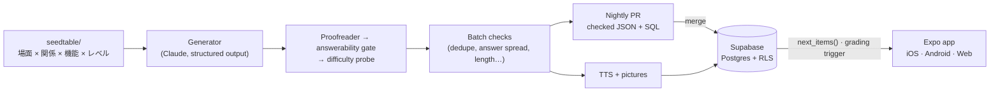

<h1 align="center">ビジネス日本語ドリル</h1>

<p align="center">
  <strong>An adaptive practice app for the BJT Business Japanese Proficiency Test — and the LLM pipeline that writes, checks, and grades its questions.</strong>
</p>

<p align="center">
  
  
  
  
  
  
  
</p>

<p align="center">
  <a href="#how-it-fits-together">Architecture</a> ·
  <a href="#quick-start">Quick start</a> ·
  <a href="#the-six-fidelity-mechanisms">Fidelity</a> ·
  <a href="#the-nightly-job">Nightly job</a> ·
  <a href="#the-database">Database</a> ·
  <a href="blockers.md">Blockers</a>
</p>

---

### At a glance

| | |
|---|---|
| 🎯 **Coverage** | All **9** problem types of the BJT's three sections (聴解 · 聴読解 · 読解), plus a rare picture type (画像把握), at three levels (J3 / J2 / J1) |
| 🧠 **Adaptive, with nothing to set** | One button. Per-section levels, a spaced-repetition ladder, and a difficulty target that follows you — all computed in SQL |
| 🤖 **LLM-generated, gate-checked** | Every generated item passes a proofreader, a two-sided answerability gate, a difficulty probe and batch-level checks before it can ship |
| 🗓️ **Offline by design** | Nothing is generated while anyone practises. A nightly GitHub Action writes a few checked items (at most $0.50 a night) and opens a pull request; merging it ships them |
| 🔊 **Real listening practice** | Role-cast TTS voices, phone-line audio treatment, and spoken options for every 聴解 item |
| 🔒 **Database is the gatekeeper** | Testers only, enforced by row-level security on every table; answers are graded by a Postgres trigger, not the client |

### How it fits together



---

A study app for the format of the **BJT ビジネス日本語能力テスト** (Business
Japanese Proficiency Test), and the pipeline that writes its questions.

> **Work in progress, and not open.** This is a personal project, built by one
> person to prepare for the BJT. It is readable here because there is no reason
> to hide it, not because it is finished or because anybody can sign up. The
> database is the door and it is shut: `public.testers` decides who may have an
> account at all, only the owner can write that table, and every row-level
> policy requires a row in it. There is no public instance, no sign-up, and no
> support. See [blockers.md](blockers.md) for what stands between this and a
> launch, and [LICENSE](LICENSE) for what you may do with what is here.

```
bjt/         the item pipeline — generate, check, publish          (Python)
seedtable/   the axes that produce variety                         (committed data)
batches/     checked bundles, their SQL, and the hand-written sets (committed data)
supabase/    schema, row-level security, and its tests             (SQL)
client/      the app: iOS, Android and web from one codebase       (Expo)
```

A few things are true of the whole system and explain most of its shape:

* **Nothing is generated while somebody is practising.** Generation is a batch
  job, and what ships is checked JSON, published as reviewable SQL. Practice
  costs nothing to serve, and the quality gates can afford to be slow.
* **One bank, shared by everybody, sorted per person.** Every learner draws from
  the same published library; what is personal is the order, decided by fixed,
  readable SQL over labels attached before the item shipped.
* **Good at something means harder questions in it.** The level is held per exam
  section, so 読解 can be J1 while 聴解 is J3, and inside a level the queue aims
  at a difficulty that follows the learner's accuracy at that problem type.
* **The learner chooses nothing about the questions.** No level, section, type,
  difficulty or mode — one button, and the database decides what is behind it.
* **The database grades answers, not the app.** The client posts which option was
  touched; a trigger decides correctness and records which trap caught them.

## The problem types

Each type has a seed table, an item schema, a generator, a worked fixture, and a
hand-written reference batch. **Exam** is how many questions of that type the
real paper asks, out of its 80; it decides which shelf the nightly run fills next
and how a practice set leans (`bjt.schemas.EXAM_QUESTIONS`, held equal to
`item_types.exam_questions` by a test):

| Section | Type | What it is | Exam | Stimulus |
|---|---|---|---|---|
| 聴解 | `bamen_haaku` | 場面把握 — hear a moment, answer about the situation | 5 | narration + spoken options |
| 聴解 | `gazou_haaku` | 画像把握 — a picture drawn for the item, four spoken descriptions | 2 † | picture + narration + spoken options |
| 聴解 | `hatsugen_choukai` | 発言聴解 — a narrated situation, four spoken utterances | 10 | narration + spoken options |
| 聴解 | `sougou_choukai` | 総合聴解 — a conversation, then a question about it | 10 | narration + dialogue + spoken options |
| 聴読解 | `joukyou_haaku` | 状況把握 — read a notice, hear a request, choose an action | 5 | narration + document |
| 聴読解 | `shiryou_choudokkai` | 資料聴読解 — a document on the page, a prompt in the ear | 10 | narration + document |
| 聴読解 | `sougou_choudokkai` | 総合聴読解 — a longer exchange and its documents | 10 | narration + dialogue + documents |
| 読解 | `goi_bunpou` | 語彙・文法 — one blank, four short fillers | 10 | text |
| 読解 | `hyougen` | 表現読解 — a situation, four expressions | 10 | text |
| 読解 | `sougou_dokkai` | 総合読解 — read a document thread, infer what changed | 10 | document |

† 画像把握 is ours, not a part of the paper. It carries the smallest share, the
nightly run writes at most one a night (`plan.NIGHT_TYPE_CAPS`), and an item is
not served until its own picture has been drawn and reviewed.

**Every 聴解 type speaks its options.** The screen shows the picture and the
bare numerals 1–4 while the candidates are read aloud, and in 総合聴解 nothing at
all; printing them would turn a listening item into a reading one. Each
candidate is introduced by the number on its badge — 「いち」「に」「さん」「よん」,
four clips for the whole library — because nothing else on screen ties a
sentence to its button. Numbers rather than letters, as on the exam's answer
sheet, and because they share no sound (「ビー」 and 「ディー」 do). An item whose
option clips do not exist yet falls back to printed options on its own.

**Length is most of what makes an item feel like the exam.** 語彙・文法 options
on the real paper are two to six characters; a 総合読解 passage is two to three
minutes of reading, four hundred to nine hundred characters. `batch.LENGTH_BANDS`
holds the ranges, the generators write to them, and `bjt checkbatch` reports a
**note** — not a warning — when a bundle falls outside: a good question of the
wrong size, not a broken one.

**The listening-and-reading types need both halves.** For 状況把握, 資料聴読解
and 総合聴読解 the answer must need both the document and the audio. A generator
quietly drops this, because a document that contains the answer is much easier
to write; the answerability gate enforces it (below).

---

## Quick start

Everything except live generation runs offline, with no API key and no Supabase
project:

```bash
pip install -e ".[dev]"
python -m bjt checkbatch batches/hatsugen_choukai_J2_001.json --show   # read a reference batch
python -m bjt seedtable --sample 5                                     # what would be written next
python -m bjt plan                                                     # which shelves of the bank are thin

pytest                                                     # the pipeline
ruff check .                                               # bugs only, not style
supabase/test/run.sh                                       # the schema, on a throwaway Postgres
cd client && npm install && npm run typecheck && npm test  # the app
```

Running the app needs a Supabase project, with email sign-in on (and **Confirm
email** off while testing) and anonymous sign-ins off. Put your address on the
tester list **before** creating the account — sign-up is refused for an address
the list does not name:

```bash
supabase db push --db-url "$SUPABASE_DB_URL"                                        # the schema
for f in batches/*.sql; do psql "$SUPABASE_DB_URL" -v ON_ERROR_STOP=1 -f "$f"; done # the bank
python -m bjt tester you@example.com | psql "$SUPABASE_DB_URL" -v ON_ERROR_STOP=1 -f -
cd client && cp .env.example .env && npm run web
```

The client needs only `EXPO_PUBLIC_SUPABASE_URL` and
`EXPO_PUBLIC_SUPABASE_ANON_KEY` — never a service-role key — and the web build
deploys to Cloudflare Workers as static assets (`client/README.md`). Here, the
**deploy database** workflow applies the migrations and every bundle's SQL by
itself after every green `checks` run on `main`, synthesises the audio the bank
still lacks, and adds a tester when run by hand.

For live generation:

```bash
export ANTHROPIC_API_KEY=sk-ant-...      # or put it in .env — see .env.example
bjt init
bjt batch --type hatsugen_choukai --level J2 -n 10
bjt publish batches/hatsugen_choukai_J2_002.json
```

(`python -m bjt <cmd>` and `bjt <cmd>` are equivalent.)

---

## Commands

| Command | What it does |
|---|---|
| `bjt init` | Create the local SQLite DB and print how to populate `seeds/`. |
| `bjt seeds [--bootstrap]` | Validate and report what's in `seeds/`. `--bootstrap` builds one from the reference batches when there is no licensed material. |
| `bjt seedtable [--type T] [--sample N]` | Inspect the 場面×関係×機能×レベル table: cells, spent cells, and what would be written next. |
| `bjt selftest` | Offline check of schema/role validation and the DB (no key). |
| `bjt gen --type T --level J2` | Generate one item, proofread and gate it, store it, print it. |
| `bjt batch --type T --level J2 -n 10` | **The main path.** Generate a batch, proofread and gate each item, run the whole-batch checks, write a bundle. |
| `bjt plan` | What the bank needs next: ten types × three levels, reading shelves first, then the shelf furthest behind its share of the exam. No key. |
| `bjt nightly [--budget N] [--per-slot N]` | Run that work order — generate, gate, check, write the SQL. What the nightly workflow calls; clamped to `BJT_NIGHT_MAX_*`. |
| `bjt importbatch <file.source.json>` | The same shape and batch checks, and the same bundle, for items written by hand. Skips the proofreader and the gate — see `bjt regate`. |
| `bjt checkbatch <bundle.json> [--show]` | Re-run every offline check over an existing bundle. No key. |
| `bjt smoke --type T -n 10` | Headless acceptance run: generate N, assert nothing crashes or fails validation. |
| `bjt practice [--type T] -n 10 [--demo]` | Answer a run of items in the terminal. `--demo` needs no key. |
| `bjt quality` | The fidelity report — all six mechanisms plus raw per-item-type accuracy. |
| `bjt discriminate --type T` | Mix official + generated items, ask a judge which are synthetic, report the rate and the tells — then fold those tells into the generator prompt. |
| `bjt calibrate --type T [--attempts-csv FILE]` | Your right/answered on the official samples (a skip is not wrong) beside your first attempts in the app. The read-only export SQL is in `--help`. |
| `bjt publish <bundle.json>` | Turn a checked bundle into idempotent SQL, applying `batches/withdrawn.txt`. |
| `bjt synth <bundle.json>` | Synthesise the bundle's audio offline and write the SQL that points at it. `--provider auto` takes `BJT_TTS_PROVIDER`, else the library's voice when its key is set, else `silent`; `--have` skips clips already live; `--remake` re-records named clips; `--upload` puts the files in the `audio` bucket. |
| `bjt audition [--voices]` | The cast saying the same eight lines, on a page to listen to (`media/audition/index.html`); `--voices` adds every voice the model offers. |
| `bjt scenes` | What the scene bank needs, and every 画像把握 picture the bank owes. `--generate` draws the missing ones and has a judge model review each draft (and, for a picture, sit the item); `--only bank`/`--only pictures` narrows it; `--upload` puts approved art in the bucket; `--sql` points the database at it. |
| `bjt render [<bundle.json>] [--item-type T] [--chart]` | Render a document stimulus to HTML — a bundle's, a type's fixture, or the worked chart example. |
| `bjt grant <user-id>` | SQL granting or revoking the ad-free unlock, as the service role. |
| `bjt tester <email>` | SQL letting one email address use the app. `--remove` takes them off; `--unlimited` lifts the daily ceiling; `--veto` lets the account unpublish a question from the app; `--max-goal N` lets it size its own day. |
| `bjt probe <bundle.json>… \| --all [--dry-run]` | Measure the difficulty prior for live items that shipped without one, a bundle at a time, so a run stopped by the `BJT_RUN_*` ceilings resumes. `--compare MODEL [--limit N]` sets the probe's model and MODEL side by side on a sample and writes nothing. |
| `bjt regate <bundle.json>… \| --all [--dry-run] [--withdraw]` | Put committed live questions through the proofreader and the gate they skipped on import. Verdicts go into `batches/regated.txt` (mark one `overruled` to keep it); `--withdraw` appends failures to `batches/withdrawn.txt` and rewrites the affected SQL. |
| `python -m bjt.client_constants` | Rewrite `client/src/lib/generated.ts`: the distractor roles the app must describe and the Japanese name of every tag. A test fails when it is stale. |
| `python supabase/snapshot.py` | Rewrite `supabase/current.sql` from the migrations. A test fails when it is stale. |

Levels are `J3` / `J2` / `J1`.

## Configuration

Every setting is an environment variable read by `bjt/config.py`; a `.env` at
the repository root is loaded when `python-dotenv` is installed (`.env.example`).

| Variable | Default | What it sets |
|---|---|---|
| `BJT_MODEL` · `BJT_GEN_EFFORT` | `claude-sonnet-5` · `medium` | the generator, and how hard it thinks |
| `BJT_JUDGE_MODEL` | `claude-sonnet-5` | the answerability gate, the discriminator judge and the picture reviewer |
| `BJT_SANITY_MODEL` · `BJT_SANITY` | `claude-haiku-4-5` · `1` | the proofreader, and `0` to skip it |
| `BJT_DIFFICULTY_MODEL` · `BJT_DIFFICULTY_TRIALS` · `BJT_DIFFICULTY` | the proofreader's model · `5` · `1` | the difficulty probe (`jev-latest` for the Jev prototype, with `TYPESAFE_API_KEY` and `BJT_JEV_URL`) |
| `BJT_GATE_TRIALS` | `3` | trials per side of the gate |
| `BJT_SLOT_PATIENCE` | `3` | discards in a row before a night gives up on a shelf |
| `BJT_RECENT_TOPICS_WINDOW` | `25` | recent topics fed back as "do not repeat" |
| `BJT_DB_PATH` · `BJT_SEEDS_DIR` · `BJT_SEEDTABLE_DIR` · `BJT_BATCH_DIR` · `BJT_MEDIA_DIR` | `bjt.db` · `seeds` · `seedtable` · `batches` · `media` | where things live (defaults under the repository root) |
| `BJT_IMAGE_MODEL` · `BJT_IMAGE_QUALITY` · `BJT_IMAGE_COMPRESSION` | `gpt-image-1` · `medium` · `80` | the picture model |
| `BJT_SCENE_ATTEMPTS` · `BJT_SCENE_LIFETIME_ATTEMPTS` · `BJT_NIGHT_MAX_PICTURES` | `3` · `6` · `4` | refusals a picture may have per run and over its life; per-item pictures drafted per run |
| `BJT_TTS_PROVIDER` · `BJT_OPENAI_TTS_MODEL` · `BJT_GEMINI_TTS_MODEL` | unset (OpenAI) · `gpt-4o-mini-tts` · `gemini-2.5-flash-preview-tts` | the voice |

**Every process that calls the API runs under ceilings it cannot lift from the
prompt**, checked before each call and independent of each other, so a bug in
one is caught by another: `BJT_RUN_BUDGET_USD` (2, priced from the usage each
response reports), `BJT_RUN_MAX_CALLS` (500) and `BJT_RUN_MAX_MINUTES` (30) stop
a run before the call that would cross them, keeping what it wrote; each call has
a `BJT_API_TIMEOUT_SECONDS` (300) timeout and at most `BJT_API_MAX_RETRIES` (2);
`BJT_MAX_TOKENS_CEILING` (8000) and `BJT_EFFORT_CEILING` (`high`) cap one call;
`BJT_NIGHT_MAX_BUDGET` (24) and `BJT_NIGHT_MAX_PER_SLOT` (6) cap a night whatever
the workflow input says.

**Secrets**, each read only by the step that needs it: `ANTHROPIC_API_KEY`,
`OPENAI_API_KEY` (pictures and the voice), `SUPABASE_URL` and
`SUPABASE_SERVICE_ROLE_KEY` (uploading either), `SUPABASE_DB_URL` (the
workflows' database steps) and `SEEDS_TAR_B64` (the licensed `seeds/`, as
`tar czf - seeds | base64 -w0`).

---

## The seed table — where variety actually comes from

Asking the prompt for variety does not work: you get the same three scenarios
forever, in slightly different words. So variety is a property of the *input*.
`seedtable/<type>.json` declares four axes — **場面 × 関係 × 機能 × レベル** —
plus the constraints that say which combinations are real. Enumerating those
gives concrete cells, each cell is consumed at most once, and the generator is
handed exactly one per item. Ten items are ten different situations by
construction.

```
$ bjt seedtable --type hatsugen_choukai
hatsugen_choukai  (seedtable/hatsugen_choukai.json)
  valid cells: 1773   used: 40   remaining: 1733
    of which shipped in batches/: 40
    J3: 591 cell(s)
    J2: 591 cell(s)
    J1: 591 cell(s)
  scene bank: 16 reusable image(s)
```

A cell is valid only when the relation fits the setting, the function can be
performed on that relation, **and** the setting's channel can carry the function
— which is what stops 「来客を迎えて案内する」 from being generated over the
telephone. ウチ/ソト is a relation of its own (`uchi_to_soto`: speaking to an
outsider about one's own people, 「部長の田中は外出しております」), not only a
distractor role.

The seed table is our own design, so it **is** committed. Growing the library is
a matter of adding rows, and "will we run out of questions?" is a count `bjt
plan` prints. Tables only ever grow: `item_id` hashes the cell, so removing or
renaming a row would orphan a spent cell, and a test holds every committed
item's cell to its table.

---

## The six fidelity mechanisms

Closeness to the real exam is treated as measurable. All six produce numbers you
can see in `bjt quality`.

1. **Distractor roles** (`bjt/fidelity/roles.py`). Every option carries a role
   from a fixed per-item-type enum — the *specific reason* it's wrong, the way the
   official 解説 spell it out. For 発言聴解 the enum is almost entirely about
   direction of respect and 場面 fit rather than grammar: `wrong_uchi_soto`,
   `over_polite_misfit`, `set_phrase_wrong_situation`,
   `phone_protocol_violation`, and so on. Items with a duplicate role, a missing
   role, a role outside the enum, or ≠1 correct option are **rejected**. Every
   option also carries a **`why`**: one Japanese sentence naming what is wrong
   with *that exact wording in that exact situation*, which is what the learner
   reads after a wrong answer.

2. **Two-sided answerability gate** (`bjt/fidelity/answerability.py`). A strong
   model answers each item under two views, up to `BJT_GATE_TRIALS` (3) times
   each, and the verdict is by count. **Full** — the whole stimulus: every
   document, every turn, the narration, the options — should *succeed* (two of
   three); failing means ambiguous, not hard. **Cold** — the half the type is
   testing withheld — should *fail* (at most one of three); succeeding means that
   half was decorative. Either way the item is discarded.

   | Type | The cold view withholds |
   |---|---|
   | 発言聴解 | the narrated situation: four utterances alone should not be separable |
   | 語彙・文法, 表現読解, 場面把握 | the stem: the options alone should not give the key away |
   | 状況把握, 資料聴読解, 総合聴読解 | the audio: an item answerable from the page alone has decorative audio |
   | 総合聴解 · 総合読解 | the conversation · the passage |
   | 画像把握 | the picture and the question (the full view reads the brief the picture is drawn from) |

   **Difficulty is measured separately** (`bjt/fidelity/difficulty.py`), only on
   items the gate kept. A strong model with the whole stimulus answers nearly
   everything, so the gate's rate says little about difficulty; a weaker model
   (`BJT_DIFFICULTY_MODEL`) sits the same full view `BJT_DIFFICULTY_TRIALS`
   times, and its pass rate ships as `model_p_correct`. A probe that could not
   run leaves the gate's rate rather than a made-up one. An opt-in prototype,
   `BJT_DIFFICULTY_MODEL=jev-latest`, asks TypeSafe AI's Jev for a probability
   per option instead (`bjt/jev.py`); `bjt probe --compare jev-latest` sets the
   two instruments side by side and writes nothing.

3. **Discriminator loop** (`bjt/fidelity/discriminator.py`). Mix official sample
   items with generated ones and ask a judge to label each. Above-chance
   discrimination means there's a tell; the judge is asked *why*, and the most
   recent tells for a type are injected into its generator prompt, so the rate
   should trend toward 50%. The judge sees what the learner sees — the 資料 and
   the 会話 too — and a comparison where only our side carries a stimulus is
   refused, because its tell would teach the generator to stop writing documents.

4. **Document templates** (`bjt/render/templates.py`). Nine — external email,
   email thread, internal notice, minutes, schedule, progress report, quotation,
   office sign, and `figures` (集計資料) — each declaring the header fields it
   cannot do without and the axes it may vary along. A document is **data**,
   rendered by us: a screenshot of an email cannot be selected, scaled, or read
   aloud, and an image model cannot spell 御中. The seed cell assigns the
   template. A `figures` or progress-report document may carry one **chart**
   (`bjt/render/chart.py`), written out figure by figure for every model that
   reads it and drawn by the app with each bar's figure printed.

5. **Proofreader** (`bjt/fidelity/sanity.py`). One small call the moment an item
   exists, before anything expensive: is the key impossible, is a second option
   just as right, does the 解説 justify a different option, is any line — a
   distractor included — something no native would say, does the situation hang
   together. Any flag discards the item. It runs first because it is one small
   call against the gate's six large ones at most, and it is deliberately *not*
   asked to re-answer the question: a cheap model disagreeing about which 敬語
   fits is the item working. An item it could not reach is recorded as unchecked, never as
   clean. The mechanical half of "no native would say it"
   (`bjt/fidelity/naturalness.py`) sends a draft back inside the generator for
   free, and every rejection's one-sentence reason is passed to the next draft
   on that shelf.

6. **Vocabulary gating** (`bjt/fidelity/vocab.py`). A JLPT-kanji-tier ceiling for
   level control, plus a business-term list. The ceiling is enforced for a level
   **only when the tier data up to that ceiling is loaded** (J3→N3, J2→N2,
   J1→N1); with partial data the gate is permissive and says so.

**No estimated BJT score is ever shown** — there is no IRT calibration for
generated items. `quality` reports raw per-item-type accuracy only. `calibrate`
is the honesty check: if you score much higher on generated items than on the
official samples, the prompts have drifted soft.

---

## Batch checks — the failures a per-item gate cannot see

Some of the worst problems only exist *across* a batch, and they are exactly the
ones that let a test-taker score without understanding anything. `bjt
checkbatch` runs these offline:

| Check | Why it matters |
|---|---|
| item validity | every item still passes its own schema and role rules |
| seed cells distinct | one item per cell, so the batch isn't secretly narrower than it looks |
| no near-duplicates | two different cells can still produce the same question (character-bigram Jaccard, `bjt/fidelity/dedupe.py`) |
| answer position spread | a learner who notices 3 is right half the time can score without listening |
| length does not leak | "pick the longest, most elaborate option" must not work — over-politeness is one of the traps |
| distractor role coverage | an enum of eight used as three is a prompt that has settled into a rut |
| per-option `why` | if this is thin, the app has nothing to show after a wrong answer |
| length matches the exam | the stem, options and documents against the paper's ranges (`batch.LENGTH_BANDS`) — a note |
| numbers are written as digits | printed matter says 10時 and 200個, as an office printer does; kanji numerals stay in names (第一会議室, 一覧) and in anything spoken (`bjt/render/numerals.py`) |
| one sentence, one notation | a sentence carrying both notations is flagged — a warning, because only a reader can tell 二案 (a count) from 案二 (a label) |
| reads like Japanese | invented keigo stacks (させていただかせていただく), a 〇〇 placeholder, brackets in something heard, a 場面把握 narration that says the answer (`bjt/fidelity/naturalness.py`); every served item must pass |
| scenes come from the bank | a 発言聴解 item is set in one of the seed table's shared scenes |
| audio manifest | a shared utterance is one clip, and no clip is listed that no item asked for |

Failures block a bundle; warnings are for the human read the pipeline ends with.
A bundle is two to six items, so a habit running through a whole type is
invisible to it: `tests/test_batch_checks.py` also sweeps the whole library, per
type, for the key being systematically the longest or the shortest option. The
fix is to specify the distractors, never to trim the answer.

---

## Bundles — what actually ships

`batches/<type>_<level>_<nnn>.json` is self-contained and app-facing: items with
their answer index, 解説, per-option `why`, the scene each is set in, and the clip
ids its audio files are named after.

```jsonc
{
  "bundle_version": 1,
  "item_type": "hatsugen_choukai", "level": "J2",
  "generated_at": "...", "generator_model": "...",
  "items": [ { "id": "...", "seed_cell": { ... }, "stem": "...", "scene_id": "...", "channel": "phone",
               "options": [{ "text": "...", "role": "...", "why": "..." }],
               "correct_index": 0,
               "model_p_correct": 0.67,
               "audio": { "narration": "<clip id>", "options": ["<clip id>", ...] } } ],
  "audio_manifest": [ { "clip_id": "...", "text": "...", "voice": "...", "channel": "phone" } ],
  "scenes": ["scene_phone_desk", ...]
}
```

### Withdrawing a question

`batches/withdrawn.txt` takes a question out of the bank: one line per item — id,
a reason from the closed set a tester's report uses (`unnatural`,
`wrong_answer`, `ambiguous`, `unclear`, `audio`, `other`), and a sentence. The
item stays in its bundle and `bjt publish` writes `is_published = false` for it,
so merging the line is the decision — like `veto_item()` in the app, an
unpublish rather than a delete, so answers already given keep resolving. The
planner, the phrasebook, the scene job and `bjt synth` stop counting it.
Nothing in a bundle's SQL ever sets `is_published = true`, so deleting the line
does not bring the item back, and a veto survives the next deploy.

The commonest reason is Japanese nobody would say — above all an over-polite
distractor invented as a keigo stack. `bjt regate` puts questions that came in
through `bjt importbatch` through the proofreader and the gate after the fact.

### Audio (`bjt/tts/`)

`plan.py` decides *what* to synthesise, `synth.py` does it offline, `channel.py`
applies the treatment, `providers.py` holds the vendor adapters, `audition.py`
writes the listening page. Nothing is synthesised at practice time.

**The voice is OpenAI** (`providers.DEFAULT`), an instructable speech model given
one house direction (`HOUSE_STYLE`): native Tokyo office Japanese at a working
pace, keigo said fluently, no acting, no announcer voice. Seven roles are cast to
seven of its voices (`OpenAIProvider.VOICE_IDS`). Gemini and Google Cloud
adapters remain for comparison, not for shipping.

- **Voices are cast by role, not per item.** A learner who hears a different voice
  every question is doing speaker identification instead of 敬語. A live clip is
  never re-made, so a role is recast before its clips are live or not at all.
- **Clip ids are content hashes** of (voice, channel, text), so 「かしこまりました。」
  is synthesised once for dozens of items; `bjt/phrasebook.py` shows the
  generators the stock lines in the wording the library already has a clip for.
- **What is spoken is a table** (`TYPE_AUDIO`): the 聴解 types speak the stem and
  all four options, the 聴読解 types the stem and any conversation, the 読解
  types nothing.
- **The narrator stays clean even on a telephone item** — the narrator is outside
  the scene. Only what happens inside it gets the band-limited phone treatment,
  because business phone Japanese really is harder to hear.

The **deploy database** workflow runs the job over the whole published bank:
only the clips the database lacks (`--have`) are made, uploaded to the `audio`
bucket and pointed at. `--provider silent` needs no vendor account and writes
valid, silent clips under `silent/`, which `--upload` refuses. Clips are stored
as WAV; a compressed delivery copy (AAC or MP3) is not built yet.

### Pictures

Both kinds are drawn offline by `bjt scenes --generate` and kept only when a
judge model reviewing the draft passes it (`bjt/scene_art.py`):

- **The shared scene bank** (16 scenes). Most listening items name a `scene_id`
  from it, chosen by the seed table. Text, names and numbers are never part of
  the art, so one drawing serves many items. A scene refused
  `BJT_SCENE_LIFETIME_ATTEMPTS` times shows a neighbour's picture instead
  (`scenes.STAND_INS`).
- **One picture per 画像把握 item** (`pic_<item id>`), because there the picture
  is the question: the reviewer must pick the marked description every time, and
  `next_items()` holds the item back until the picture exists.

The rules: no readable text, no logo, no recognisable likeness, nothing
malformed, and nothing that fixes the situation more tightly than the setting —
a bank picture that gives the scenario away would make the listening optional.
Every refused draft is kept with its reason.

---

## The reference batches

`batches/*.source.json` are written by hand. The first batch of a new type
deliberately does not come out of a model — that is how you find out what the
generator should aim at. Every type has one at J2, written to exercise the
distractor roles in its enum (ten 発言聴解 items in
`hatsugen_choukai_J2_001.source.json`, four to six for the others), and smaller
hand-written sets fill the other levels. They run through the same validation
and whole-batch checks as generated items (`bjt importbatch <file>`); what they
skip is the model calls.

Every committed bundle is the regression set: `tests/test_batch_checks.py` sweeps
`batches/*.json` rather than naming files, so a new batch is covered the moment
it lands. Three invariants only exist *across* bundles and are tested over the
whole library:

* **No seed cell is spent twice** — `item_id` hashes (type, cell), so a second
  item for a spent cell would silently replace the first on publish.
* **Item ids are unique** — `bjt publish` upserts on id; a collision is data loss.
* **The dedupe threshold holds across bundles** — a learner meets the library,
  not a bundle.

They are original compositions, **not** official BJT material — no past-paper text
is ever copied into this repository.

---

## The nightly job

The queue's promises — spread a set across types, serve three levels, slip in
one item from the level above — are empty when a shelf is bare. So the bank has
30 shelves (ten types × three levels), and the nightly job fills the one furthest
behind its share of the exam:

```
$ bjt plan
The bank, shelf by shelf (items published / seed cells left)

  bamen_haaku         J3   3 / 362     J2   5 / 359     J1   2 / 362    ←thin
  gazou_haaku         J3   0 / 149     J2   1 / 145     J1   0 / 149    ←thin
  ...

Work order — 3 item(s), furthest behind its share of the exam first; 1 of them 読解 (reading first, then the rest)

   1 × gazou_haaku J1   (has 0, 149 cell(s) left)
   1 × sougou_choudokkai J1   (has 1, 160 cell(s) left)
   1 × hyougen J3   (has 2, 685 cell(s) left)
```

The rule is plain on purpose: the first `--reading-min` items go to the emptiest
reading shelves (no audio, no picture); each next item goes to the shelf
furthest behind its share, skipping a shelf that is out of seed cells, has had
its `--per-slot` share of this run, or whose type has had its night's allowance.
It is **deterministic**, so a night can be reviewed before it is made; it
**converges**, levelling shelves rather than deepening the easiest type; and it
**stops** when a seed table is exhausted. `--budget` and `--per-slot` keep a
night's diff short enough for a person to finish.

The planner deliberately does **not** look at individual learners: targeting one
person costs money per person, puts a profile into a prompt, and cannot be
reviewed before it is served. Weakness targeting happens in the *queue*, where it
is free and reversible. If generation is ever aimed at weakness, it will be at
thresholded aggregates across learners ("telephone × 部下→上司 × 依頼 is
under-covered") feeding this planner, never at one person.

### What runs, and when

`.github/workflows/nightly.yml` runs every night at 03:00 JST, cheaply: three
items at most, two to a shelf, at least one of them reading, and never more than
fifty cents (`BJT_RUN_BUDGET_USD`, held at or below 0.5 by
`tests/test_ceilings.py`). A manual run has the same defaults, and can run the
difficulty probe (`bjt probe --all`) instead of writing.

* **the survey** — `bjt plan` into the run summary, every run, offline.
* **the recount** — with `SUPABASE_DB_URL`, `refresh_item_stats()`.
* **the writing** — with `ANTHROPIC_API_KEY`: `bjt nightly`, `checkbatch` over
  every bundle old and new, then a pull request. Few-shot examples come from the
  licensed `seeds/` when `SEEDS_TAR_B64` is set, else from the reference batches
  (`bjt seeds --bootstrap`), and the summary says which.
* **the pictures** — with `OPENAI_API_KEY` too: each new 画像把握 item's picture
  every night, the bank's missing scenes on Sundays or when asked.

The night's files become a run artifact before anything is pushed. **Nothing
here publishes**: the pull request is the review gate — the one exception to the
repository's work-on-`main` rule — and merging it is the decision to ship. Once
`checks` is green on `main`, the **deploy database** workflow publishes the items
and their audio by itself.

---

## The database

`supabase/migrations/` is the schema; `supabase/current.sql` is the latest
definition of every function, view and trigger, generated for reading and never
applied.

**Testers only, and the database is the door.** `public.testers` lists who may
use the app by sign-in email. Every row-level policy in `public` requires
`is_tester()`, the anon role reads nothing, content included, and a schema test
fails a policy that forgets the check. In front of that,
`refuse_unlisted_signup()` refuses a sign-up for any address not already listed,
so an empty list means nobody can make an account. The schema keeps an
anonymous-first sign-in for when the app opens; opening it is one migration.

**Content has no write policy; everything personal is the owner's.** Publishing
runs as the service role, so no key that can write content ships in the app.
Per-user tables are restricted to `auth.uid()`, and the stats views are
`security_invoker`.

**Grading is a trigger.** The client inserts `item_id`, `chosen_index` and how it
was answered (`session_id`, `elapsed_ms`, `think_ms`, `replays`, `peeked`,
`stands_for`); the trigger fills in who, whether it was right, and
`chosen_role` — *which* trap caught them. "You get 発言聴解 wrong 40% of the time"
is a grade; "eleven times this month you pointed 尊敬語 at yourself" is a plan
for the evening. `attempts` has no `update` or `delete` policy; the one way to
start again is `reset_my_progress()`, the whole history or none of it.

**The level is per section.** The exam reports 聴解, 聴読解 and 読解 separately,
and almost nobody is the same at all three. `section_levels` holds three levels,
starting at J2, and `adjust_level()` moves the one an answer belongs to on the
last ten first attempts at that level (twenty once there is a record): 80% right
moves it up, 40% or fewer down. The window never exceeds the questions the level
has left for the learner and is never judged on fewer than five; nobody is moved
into a level with fewer than five questions left; an answer given after a replay
or with the spoken options read counts for neither direction, because the exam
plays once. `profiles.target_level` is only the one-line summary. Three levels
rather than one per type, because a per-type level would wait weeks to move; the
finer grain is the pitch, below.

**`next_items()` is the practice queue — it takes a size and nothing else.** The
set is built from the record, in this order:

| | | |
|---|---|---|
| 0 | **due** | lessons the spacing ladder says are due, misses first — each served as a **類題**: an unseen question of the same type that sets the trap which caught the learner (or shares its 機能, for a lesson learnt without being caught). At most two fifths of the set. |
| 1 | **fresh** | unseen items at their section's level, weakest ground first, spread across types and settings. |
| 2 | **stretch** | one unseen item from the level above, in the section they are **strongest** in, where a promotion is closest. `adjust_level()` ignores it. |
| 3 | **the rest** | every other unseen question, nearest level first, before any question already met. |

**A due review is a new question, not the same one.** Re-meeting the same four
sentences tests whether you remember "it was 3"; the exam asks the trap again in
a situation you have not seen. So the ladder schedules the *lesson*, and the
類題 carries `stands_for` naming it: the answer moves that lesson's rung, and
`grade_attempt()` clears a `stands_for` the queue could not have served. The same
question comes back only when nothing unseen is left.

"Weakest ground" is arithmetic you can check by hand:

* **The 機能 tag they score worst on**, as `(right + 1) / (answered + 2)` so one
  miss does not read as 0%, with every answer on a 30-day half-life.
* **The traps that keep catching them** — an unseen item with a distractor whose
  role has caught this person before is pulled forward, capped so one habit
  cannot take over a set.
* **The weakest section**, by up to a tenth of a point.
* **The pitch** — how hard the item should be for *this* learner at *this* type.
  The queue prefers items whose success rate is near a sliding target:

  ```
  target = 0.85 − (your accuracy at this problem type) × 0.35,  held in [0.50, 0.80]
  ```

  At 90% on 発言聴解 you are handed items the bank answers right about 55% of the
  time; at 30%, about 75%. Unlike the level, this moves on every answer.

Three nudges keep a set varied: a second item of a type is pushed back, a third
further; the same for 場面 at a third of the weight; and each item of a section
beyond its share of the set (the exam's 25 / 25 / 30, from
`item_types.exam_questions`) costs a quarter of a point — a full point in the
last two weeks before the learner's exam date. The terms have an order of
authority: the 機能 tag dominates, traps and the pitch come second, the nudges
third, and the tie-break random is a fiftieth of a point, so it can only separate
genuine ties. Noise above the pitch would silently switch it off on the early
sets where it is the only signal.

**The spacing ladder is a trigger.** `review_schedule` holds one row per
(learner, lesson) on a fixed five-rung ladder — 20 hours, 3 days, 1 week, 3
weeks, 2 months — and the trap that caught them. Right climbs a rung, wrong drops
to the bottom, and a question known at first sight starts on three days. A right
answer holds its rung when it was slow (past the reading clock's maximum, or
thirty seconds after the audio, timed by `think_ms`) or helped by a replay or the
spoken options read. With an exam date set, due dates are brought in ahead of it.
A fixed table rather than a fitted forgetting curve, because a curve needs
calibration these items do not have and the start screen states the intervals as
a promise. The client cannot write it.

**The bank's difficulty comes from everyone's answers.** `item_stats` counts each
person's first answer to each item, timeouts left out; `refresh_item_stats()`
recounts it from nothing out of hours. It is a property of the question — never
of a person, never displayed, no IRT behind it — and clients cannot read it: with
a handful of users, "answered 1, correct 0" is a statement about somebody. They
read `v_item_difficulty`, which exists only above eight answers from eight
people. Until then the pitch runs on `items.model_p_correct` from generation
time; an item imported by hand has none, the queue reads that as "no opinion",
and `bjt probe --all` measures it. `bjt plan` prints the coverage.

**Ten a day, fifteen at most, and the database counts.** The daily set is
`profiles.daily_goal` (10); one bonus set follows, and at fifteen answers in a
Japanese calendar day `next_items()` returns nothing (`v_my_day` is the row the
app and the queue both read). A tester row can lift the ceiling (`--unlimited`),
or let one account size its own day (`--max-goal N`).

**The reading questions are timed, at the exam's pace.** 聴解 and 聴読解 advance
with the audio; 読解 is 30 questions in a freely navigable 30-minute block, so
pacing is a skill. `item_types.seconds_per_item` divides the block — 語彙・文法 30,
表現読解 45, 総合読解 105, which is 1800 seconds for ten of each — and
`client/src/lib/pace.ts` scales it by how much a particular item puts on screen,
clamped to 0.6–1.6. A question nobody answers in time is recorded as
`chosen_index = -1`, graded wrong, with the role `timed_out`.

**What a learner can set is how they practise, never what they are served.**
`profiles.timed_reading` turns the reading clock off; `profiles.exam_date` is a
fact the record reads (due dates come in ahead of it, and in its last two weeks
the section mix is strict and the clock runs regardless); `profiles.daily_goal`
is editable only on the account its tester row allows.

**Reporting a bad question.** `item_feedback` takes one row per person per item —
a reason from a closed set (unnatural, wrong answer, ambiguous, unclear, audio,
other) and an optional sentence — and nothing in the queue reads it: an item that
vanished on one press would leave a bank one press from empty. The closed set
makes reports a count the generator loop can act on:

```sql
select i.item_type, f.reason, count(*), max(f.created_at)
  from public.item_feedback f join public.items i on i.id = f.item_id
 group by 1, 2 order by 3 desc;
```

An account with `testers.may_veto` can instead unpublish a question from the
practice screen for everybody (`veto_item()`, which re-checks the permission
rather than trusting the button). It is an unpublish, never a delete, nothing is
recorded against the learner, and `item_vetoes` keeps who and when.

### Checking it

`supabase/test/run.sh` applies every migration to a throwaway Postgres — no
project, no keys, no network — and asserts what the schema promises: one user
cannot read another's history and nobody off the tester list reads a row; a
client cannot claim its own answer was right, grant itself the paid unlock, move
its review dates, set its level, or read the raw per-item counts; a published
bundle applies twice without duplicating; the ladder drops on a miss and climbs
on a hit; being good at listening moves 聴解 and leaves 読解 alone; two learners
with opposite records are handed opposite items out of the same pair. It finishes
by reading every query in `client/src/lib` and asserting each table, view, column
and function the app names actually exists — TypeScript checks the app against
the types we *claim* the database has; this checks the claim.

---

## Seeds (`seeds/` — gitignored)

Licensed material never gets committed. It loads at runtime from `seeds/`
(`cp -r seeds.example seeds`, then replace the placeholders):

| Path | Contents |
|---|---|
| `seeds/fewshot/<type>.json` | 3-5 official-style examples **with their 解説** and per-option `why`. |
| `seeds/official/<type>.json` | Official sample items (with the answer marked) for `discriminate` / `calibrate`. |
| `seeds/vocab/business_terms.txt` | The 重要ビジネス用語表現集 list, one term per line. |
| `seeds/vocab/jlpt_n5_kanji.txt` … `n1` | Kanji per tier (any whitespace-separated). |
| `seeds/levels.json` | The official CAN-DO descriptors per level. |

Everything degrades gracefully when a seed is missing, and `bjt quality` says
what is absent. `bjt seeds --bootstrap` builds few-shot examples from the
reference batches; it never invents official items, kanji tiers or descriptors.

---

## Layout

```
bjt/
  cli.py, __main__.py  entry point (`bjt`, `python -m bjt`)
  config.py      every setting, read from the environment
  llm.py         Anthropic client wrapper: structured output only, and the run ceilings
  generators/    one generator class per item type (listening.py and reading.py hold several)
  schemas.py     item JSON schemas and validation; each type's section and exam question count
  fixtures.py    a worked example item per type (selftest, practice --demo, render)
  seedtable.py   場面×関係×機能×レベル → cells
  seeds.py       what the gitignored seeds/ holds, and --bootstrap from the reference batches
  levels.py      CAN-DO descriptors (loadable from seeds)
  pipeline.py    one draft through every check, and a shelf of drafts (bjt batch, bjt nightly)
  plan.py        which shelf of the bank is furthest behind, and tonight's work order
                 (not tts/plan.py, which decides what to synthesise)
  batch.py       the bundle format and the whole-batch checks
  publish.py     bundle → idempotent SQL
  withdrawn.py   the questions taken out of the bank (batches/withdrawn.txt), and what still counts
  backfill.py    passes over the bank that already shipped: bjt probe, bjt regate
  fidelity/      roles, proofreader, naturalness lint, answerability gate, difficulty probe,
                 discriminator loop, vocab gate, dedupe
  jev.py         the opt-in Jev instrument for the difficulty probe (prototype)
  calibration.py official samples against your first attempts in the app
  phrasebook.py  the stock spoken lines, in the one wording the library has a clip for
  render/        document data → semantic HTML: the nine templates, charts, the numeral rule
  tts/           what to synthesise, in which voice, over which channel — and the offline
                 job that does it (plan.py, synth.py, channel.py, providers.py, audition.py)
  scenes.py      what the scene bank and the 画像把握 pictures need, and what exists
  scene_art.py   drawing, reviewing and uploading those pictures
  textutil.py    small text helpers for the fidelity checks
  client_constants.py  the roles and tag names the app needs, written as client/src/lib/generated.ts
  db/            the local SQLite store: items, answers, fidelity results
seedtable/       the axes — committed
batches/         bundles and their SQL, the hand-written sources, withdrawn.txt, scenes.sql — committed
seeds.example/   committed templates; real content goes in gitignored seeds/
supabase/
  migrations/    the schema: tables, RLS, triggers, views, the practice queue
  current.sql    the latest definition of every function, view and trigger — generated, read-only
  snapshot.py    writes current.sql from the migrations
  test/          run.sh — the whole schema, proved against a throwaway Postgres
client/          the Expo app (see client/README.md)
tests/           the pipeline's tests, including the library-wide sweeps
```

## Design notes

- **Structured output only.** Every Claude call uses `output_config.format` with
  an explicit JSON schema; free text is never parsed.
- **One generator per item type.** No generic "generate a BJT question" function
  with a type parameter — item shapes differ too much.
- **The cell is an assignment, not a hint.** Every type refuses to generate
  without one (`requires_cell`), and an item that substitutes a different scene,
  channel or template is rejected and regenerated.
- **Option order is shuffled** at generation time, and `checkbatch` verifies the
  spread across the batch.

## Naming

"BJT" is a registered trademark. It is used here to describe the exam format this
tool targets; it is not part of any product name, slug, or bundle identifier — the
app is 「ビジネス日本語ドリル」. A store description may say it follows the BJT
format; the name may not.

This project is independent. It is not affiliated with, endorsed by, or
connected to the organisation that runs the exam, and nothing here is an
official study material. No past-paper text is copied anywhere in this
repository: every item is an original composition, which is why generation was
a requirement from the start rather than a convenience.

## License

All rights reserved — see [LICENSE](LICENSE). The source is published to be
read, not to be reused; the question bank in `batches/` is not offered as
training data or as content for another study tool. To use something here, open
an issue and ask.
