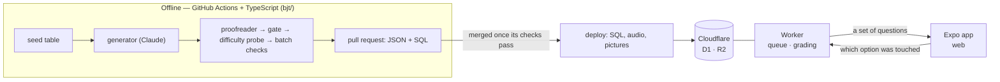
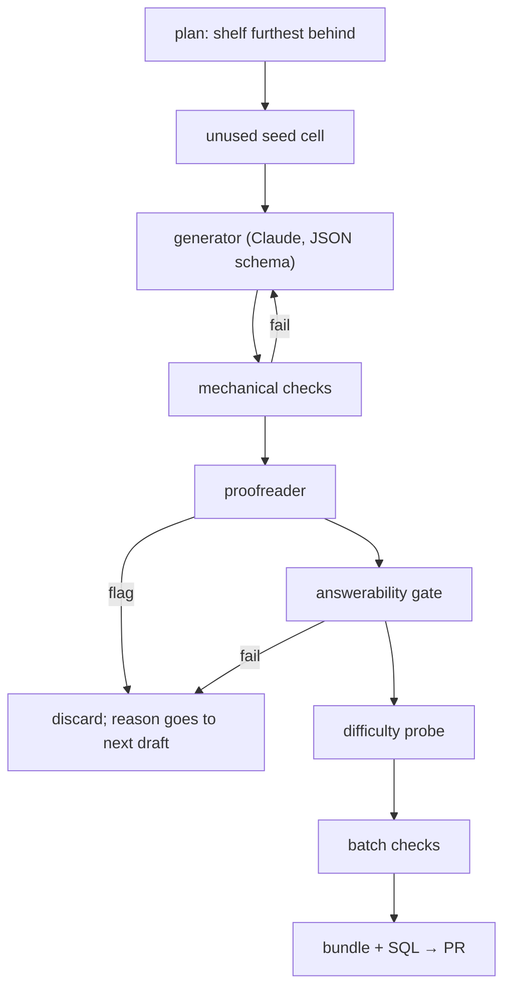

<h1 align="center">ビジネス日本語ドリル</h1>

<p align="center">
  <strong>An adaptive practice app for the BJT Business Japanese Proficiency Test — and the LLM pipeline that writes, checks, and grades its questions.</strong>
</p>

<p align="center">
  
  
  
  
  
  
</p>

> **Work in progress, and not open.** A personal project for preparing for the
> BJT. Only addresses on a tester list can create an account. See
> [blockers.md](blockers.md) for what remains before a launch and
> [LICENSE](LICENSE) for terms.

This README goes top-down: what the app is, how it runs, then each part in
turn. Reading it end to end should explain the whole system without the code.

1. [What it is](#1-what-it-is)
2. [How it runs](#2-how-it-runs)
3. [The app](#3-the-app)
4. [The questions](#4-the-questions)
5. [How a question is made](#5-how-a-question-is-made)
6. [How questions ship](#6-how-questions-ship)
7. [The database](#7-the-database)
8. [Working on it](#8-working-on-it)

---

## 1. What it is

A study app for the **BJT ビジネス日本語能力テスト** (Business Japanese
Proficiency Test): an 80-question exam on Japanese at work — calls, meetings,
emails, documents, and whether what you say fits who you say it to — in three
sections: **聴解** (listening), **聴読解** (listening + reading) and **読解**
(reading).

A learner presses one button and answers about ten questions a day. After each
answer the app shows *why* it was wrong in the exam's own terms ("honorifics
about your own boss, to a client"), not just "wrong". Over time it works out a
level per section, brings back the traps that caught the learner in new
questions, and aims each question at the right difficulty.

Every question is original, written by Claude **offline in a nightly batch
job**, checked by other models and fixed rules, and read by a person before it
ships.

**Principles**

* **Nothing is generated while anyone practises.** Serving costs nothing; the
  quality checks can be slow.
* **One shared bank, sorted per person** by fixed, readable SQL.
* **Three levels, one per section** — J3 (easiest), J2, J1 (hardest). Most people
  are J1 at one section and J3 at another.
* **The learner chooses nothing about the questions.** No level, type or mode
  picker; the database decides.
* **A mistake returns as a new question**, not the same one.
* **The database grades answers**, not the app.
* **No invented numbers** — no predicted exam score anywhere.

---

## 2. How it runs



Three programs that only meet in the database:

1. **The pipeline** (`bjt/`, TypeScript on Node) writes questions, checks them, makes their
   audio and pictures, and outputs **bundles** (JSON) plus the **SQL** that
   publishes them. Runs locally or in GitHub Actions — never behind the app.
2. **The database and its Worker** (`d1/`, `client/worker/`) — Cloudflare D1
   holds the bank and every answer; the Worker in front of it does the thinking
   at practice time: building each set (`core/queue.ts`), grading answers
   (inside the INSERT, with triggers refusing anything else), moving levels and
   reviews, and turning away everyone but testers.
3. **The app** (`client/`, Expo / React Native) signs in, fetches a set, plays
   the audio, shows the question, sends back the chosen option, and shows the
   feedback. It has no grading or selection logic of its own.

**A day:**

| When | What happens |
|---|---|
| 03:00 JST | The **nightly** workflow writes up to 3 questions (≤ $0.50) and opens a pull request, the night's record. |
| Minutes later | It runs **checks** on that branch; when every job is green it merges the pull request and starts **deploy database**, which applies migrations, runs every bundle's SQL, and makes missing audio. A red check leaves the pull request open for the owner. |
| Any time | A learner presses the button; the Worker builds a set of 10 and the database grades each answer. |
| 15 answers | Nothing more is served, and the database accepts nothing more, until midnight in Japan. |

**Hosting:** everything the app touches is on **Cloudflare**: the web app and
its API on **Workers**, the data in **D1**, the clips and pictures in **R2**,
sign-in by **Access**; jobs on **GitHub Actions**. Paid APIs: **Anthropic**
(writing and review), **OpenAI** (voices, pictures), and optionally **TypeSafe
AI** (Jev, a difficulty-probe prototype).

**Cost:** only the batch jobs spend. Every API process has ceilings checked
*before* each call — dollars (default $2; $0.50 a night), call count (500), run
time (30 min) — plus per-call output caps. Hitting one stops the run and keeps
what it wrote.

```
bjt/        the pipeline (TypeScript)      d1/         the schema (SQLite migrations)
seedtable/  variety axes (data)            client/     the app (Expo)
batches/    published bundles + SQL        tests/      pipeline tests
```

---

## 3. The app

**Getting in.** First launch shows one explanation screen (your answers set your
level; questions aim at your mistakes; your part is to answer). Sign-in is
Cloudflare Access, in front of the whole site. Only listed testers get in;
others see "not open yet". The Worker enforces this — the screens only explain
it.

**Home.** One button, a ring for today's progress, a streak, and an exam
countdown if a date is set. After the day's limit it becomes a "done for today"
screen.

**A practice set** is fetched in one request (it survives a train tunnel). Each
question has four moments:

1. **Scene** — who, where; the setting's picture and any document.
2. **Listen** — audio plays once. For 聴解 the options are *spoken*, introduced as
   「いち」「に」「さん」「よん」, with only numbered buttons on screen. Reading
   questions skip this.
3. **Answer** — pick one of four. **Replay** and **show options as text** are
   available but mean the answer doesn't count as "known".
4. **Reveal** — graded by the database, then:
   * a drawn **face** of the listener reacting (ruder = worse), where the
     mistake was about manners;
   * **one sentence** naming the trap that caught you;
   * for manners mistakes, the **失礼度メーター**: two bars, *rude* and *wrong for
     the situation*;
   * the **解説**, each option's reason, and vocabulary notes.

**Reading questions are timed** at the exam's pace, scaled to how much there is
to read; time out = wrong. The clock can be turned off, except in the last two
weeks before the exam date.

**Reporting.** After answering, "this question is wrong" offers fixed reasons
(unnatural, wrong answer, ambiguous, unclear, audio, other). The owner's account
also has a **veto** that unpublishes a bad question for everyone.

**Result.** How many were right, the trap that caught you most, and any section
whose level moved. No score.

**Tabs:** **ホーム**, **記録** (progress), **アカウント** (account). From 記録:

* **記録** — the three sections like the exam's score report, a radar of all
  types, recent traps and weak topics (last 30 days).
* **解いた問題** — past answers, wrong ones first, each reopenable in full, with
  a **復習ノート** for your own note.
* **まちがえた問題のことば** — key words from questions you missed, with self-test.
* **ことば一覧** — every noted word from questions you've answered, searchable.
* **アカウント** — levels (shown, not chosen), exam date, reading clock,
  language (UI in Japanese or English; questions always Japanese), and a full
  reset.

**The app never** offers choices about questions, grades answers itself, shows
ads during practice (the ad slot type only allows the result and list screens;
no ad network is connected), or predicts a score. On the web, keys 1–4 / a–d
answer and Enter continues.

---

## 4. The questions

### Types

Nine types from the exam plus one of ours. **Exam** = how many the real paper
asks of 80; it sets how the bank and each set lean.

| Section | Type | What it is | Exam |
|---|---|---|---|
| 聴解 | `bamen_haaku` 場面把握 | hear a moment, answer about the situation | 5 |
| 聴解 | `gazou_haaku` 画像把握 | a picture made for the item, four spoken descriptions | 2 † |
| 聴解 | `hatsugen_choukai` 発言聴解 | a situation, four spoken replies | 10 |
| 聴解 | `sougou_choukai` 総合聴解 | a conversation, then a question | 10 |
| 聴読解 | `joukyou_haaku` 状況把握 | read a notice, hear a request, choose an action | 5 |
| 聴読解 | `shiryou_choudokkai` 資料聴読解 | a document on screen, a prompt by audio | 10 |
| 聴読解 | `sougou_choudokkai` 総合聴読解 | a longer exchange and its documents | 10 |
| 読解 | `goi_bunpou` 語彙・文法 | one blank, four short fillers | 10 |
| 読解 | `hyougen` 表現読解 | a situation, four expressions | 10 |
| 読解 | `sougou_dokkai` 総合読解 | a document thread; infer what changed | 10 |

† Not on the paper: at most one written a night, and never served before its
picture exists. Everyone starts at J2 in every section.

* **聴解 options are spoken, not printed**, so listening stays listening.
  Numbers, not letters (「ビー」 and 「ディー」 sound alike).
* **聴読解 answers need both the document and the audio** — enforced by the gate
  (§5).
* **Length matches the paper** (e.g. 語彙・文法 options 2–6 characters;
  総合読解 passages 400–900).

### What a question contains

* a **stem** (and narration for listening types);
* **four options**, one correct; each has a **role** (why it's wrong, from a
  fixed list per type) and a **why** sentence shown after choosing it;
* a **解説** (Japanese and English) and **vocabulary notes**;
* its **seed cell** (setting × relationship × business function), whose tags
  drive weakness targeting;
* for listening: a **scene** picture, a **channel** (in person / phone), audio
  **clip ids**, and any **conversation**; for documents: the **documents**;
* **`model_p_correct`** — how often a model got it right when made; the
  difficulty estimate until real answers accumulate.

### Distractor roles

Each wrong option is a named kind of mistake — for 発言聴解 mostly respect and
fit: `wrong_uchi_soto`, `over_polite_misfit`, `set_phrase_wrong_situation`,
`phone_protocol_violation`… When a learner picks one, the database records *which
role* caught them. That makes feedback specific ("11 times this month you used
honorifics about yourself") and lets reviews re-test the same trap in a new
question. Wrong options must be **real Japanese used wrongly**, never invented
(no させていただかせていただく).

### Documents and numbers

Documents (emails, notices, minutes, schedules, quotations, signs, figures…)
are **data rendered by the app**, not images — nine templates, optionally with
one chart whose figures every checker reads. **Printed numbers are digits**
(10時, 200個); kanji numerals stay in names (第一会議室) and anything spoken.

---

## 5. How a question is made



A shelf gets a few attempts; each rejection's reason is passed to the next draft.

**Seed table.** Asking a model for "variety" yields the same few scenarios. So
`seedtable/<type>.json` defines axes — **場面 × 関係 × 機能 × レベル** — and
valid combinations (e.g. no greeting a visitor *by phone*). Each **cell** is used
once, so ten questions are ten situations. Tables only grow (an item's id hashes
its cell). `bjt plan` shows how many remain.

**Generation.** One generator per type; every Claude call uses a strict JSON
schema, so nothing is parsed from free text. The prompt carries the cell (as an
assignment), example questions, the level, naturalness rules, recent topics to
avoid, and stock spoken phrases in the wording that already has audio. Options
are shuffled afterwards.

**Checks**, cheapest first (`bjt quality` reports them):

1. **Roles** — exactly one correct option; every role valid and distinct.
2. **Naturalness lint** — invented honorific stacks, placeholders, brackets in
   speech, narration that gives the answer away. Fails go back to the generator.
3. **Proofreader** (small model) — is the key wrong, another option also right,
   the 解説 inconsistent, any line un-Japanese, the situation incoherent? Any flag
   discards. It doesn't answer the question itself.
4. **Answerability gate** (strong model, up to 3 tries per view). **Full view**
   (everything) must be answered right 2/3 — else ambiguous. **Cold view** (the
   tested half withheld) must fail — else that half was decorative:

   | Type | Cold view withholds |
   |---|---|
   | 発言聴解 | the situation |
   | 語彙・文法, 表現読解, 場面把握 | the stem |
   | 状況把握, 資料聴読解, 総合聴読解 | the audio |
   | 総合聴解 · 総合読解 | the conversation · the passage |
   | 画像把握 | the picture and question |

5. **<a id="the-difficulty-probe"></a>Difficulty probe** — a *weaker* model
   (Haiku) takes the full view 5 times; its pass rate becomes `model_p_correct`.
   If it can't run, nothing is written. Prototype: **Jev** (TypeSafe AI) returns
   a probability per option in one call; off unless switched on, and `bjt probe
   --compare jev-latest` compares the two without writing anything. Jev costs
   $0.042 per million input tokens, and output is free: about 700 tokens and
   $0.00003 a question (the first 20-question comparison cost $0.0005).
6. **Vocabulary gate** — kanji ceiling per level (from JLPT lists, when loaded).
7. **Discriminator** (occasional) — a judge mixes official and generated
   questions and says which is which; its reasons feed back into the prompts.

No predicted BJT score exists: generated questions have no statistical
calibration. `bjt calibrate` compares your accuracy on official samples with the
bank instead.

**Batch checks** (`bjt checkbatch`, per bundle and across the library): valid
items, distinct cells, no near-duplicates, answer positions spread, the key not
systematically longest, role coverage, every option has a `why`, lengths match
the exam, digits in print, natural Japanese, scenes from the bank, audio
manifest consistent. Failures block a bundle.

**Bundles.** `batches/<type>_<level>_<nnn>.json` holds complete questions;
`bjt publish` writes idempotent SQL beside it.

```jsonc
{ "item_type": "hatsugen_choukai", "level": "J2",
  "items": [ { "id": "...", "seed_cell": {...}, "stem": "...", "channel": "phone",
               "options": [{ "text": "...", "role": "...", "why": "..." }],
               "correct_index": 0, "model_p_correct": 0.67,
               "audio": { "narration": "<clip>", "options": ["<clip>", "..."] } } ],
  "audio_manifest": [ { "clip_id": "...", "text": "...", "voice": "...", "channel": "phone" } ] }
```

**Withdrawing.** A line in `batches/withdrawn.txt` (id, reason, sentence)
unpublishes a question on merge. Never deleted, never auto-restored. `bjt regate`
re-checks hand-imported questions.

**Audio** (`bjt/tts/`, offline only). OpenAI TTS with one house style (natural
Tokyo office Japanese, no acting). **Seven fixed roles** — narrator, junior and
mid-career staff (m/f), manager, receptionist — so voices never change between
questions. Clip ids hash (voice, channel, text): a shared line is one file, and
a live clip is never re-made. 聴解 speaks stem + options, 聴読解 stem + dialogue,
読解 nothing. Phone lines get a phone sound; the narrator never does.

**Pictures** (`bjt/scene_art.ts`, offline). A shared bank of 16 setting
pictures, plus one picture per 画像把握 question (which must let a reviewer pick
the correct description every time). No text, logos or real faces; every draft
is reviewed by a model and refusals are kept with reasons.

**Reference batches** (`batches/*.source.json`) are hand-written examples per
type; every committed bundle is also a regression test.

---

## 6. How questions ship

**The planner** (`bjt plan`) has 30 shelves (10 types × 3 levels). Each night:
first a reading question (cheapest), then the shelf furthest behind its exam
share — max 2 per shelf, 画像把握 max 1. Deterministic, so it can be reviewed in
advance. It never targets individual learners; personalisation happens in the
queue.

**Workflows:**

* **nightly** (03:00 JST, or by hand from `main`) — survey the bank, recount question
  difficulty from all answers, write up to 3 questions, draw needed pictures,
  open a PR — the night's record — then run **checks** on that branch and, when
  every job is green, merge it and start **deploy database**. A red check leaves
  the PR open with a comment saying why. Manual options: **probe** (measure
  unrated questions) or **compare_jev** (Jev vs the default probe; writes
  nothing). Work is saved as an artifact before any push.
* **checks** (every push to `main`, every PR, and each night's branch) — the
  pipeline's vitest suite, typecheck and lint, schema tests (and the app's
  generated database types), app typecheck, lint and tests, checkbatch.
* **deploy database** (after green `checks` on a push to `main`, deploying
  that commit; or by hand from `main`) — migrations,
  every bundle's SQL, missing audio. Idempotent. Manual runs can add a tester
  (email masked in the public log).
* **Web app** — Cloudflare rebuilds `client/` from the repo.

**Secrets** (each read only by the step that needs it): `ANTHROPIC_API_KEY`,
`OPENAI_API_KEY`, `CLOUDFLARE_API_TOKEN` + `CLOUDFLARE_ACCOUNT_ID` (D1),
`R2_ACCESS_KEY_ID` + `R2_SECRET_ACCESS_KEY` (media uploads), `SEEDS_TAR_B64`
(licensed examples), `TYPESAFE_API_KEY`. The repository **variable**
`BJT_DIFFICULTY_MODEL` picks the probe model (unset = Haiku; `jev-latest` =
Jev). None of them goes near the app.

---

## 7. The database

`d1/migrations/` is the schema (SQLite, on D1); the logic that used to be SQL
functions is TypeScript in `client/worker/core/`, one file per job.

| Group | Tables |
|---|---|
| Bank | `items`, `item_options`, `item_types`, `bundles`, `scenes`, `audio_clips` |
| Learner | `profiles`, `section_levels`, `practice_sessions`, `attempts`, `review_schedule`, `review_notes` |
| Shared stats | `item_stats` (read only by the queue) |
| Who | `users` (one per signed-in address) |
| Access | `testers`, `entitlements` (ad-free unlock) |
| Quality | `item_feedback`, `item_vetoes` |

**Access.** Cloudflare Access signs everybody in; the Worker turns away every
query from an address not in `testers`, and makes no account for one
(`core/caller.ts`). The app can only name a query (`worker/queries.ts`), never
send SQL, and every query reads and writes only the caller's own rows. Content
is written only by the deploy workflow.

**Grading.** The app sends `item_id`, `chosen_index` and how it was answered
(timings, replays, `peeked`, `stands_for`). The INSERT fills in correctness and
the **role** that caught the learner from the item itself, and a trigger refuses
any other grade; reviews and levels move in the same all-or-nothing batch
(`core/grade.ts`). Answers can't be edited (a trigger) or deleted;
`resetProgress` erases everything or nothing.

**Levels (per section).** `core/levels.ts` looks at the last 10 first attempts at
the current level (20 once there's history; never fewer than 5): **≥ 80% right →
up, ≤ 40% → down.** No move into a level with under 5 unseen questions left.
Answers after a replay or with options shown as text don't count.

**The queue builds a set** (`core/queue.ts`; size is its only input):

| Order | Source |
|---|---|
| 1 | **Due reviews** (≤ 2/5 of the set), misses first — each as a **類題**: an *unseen* question with the same trap |
| 2 | **Fresh** questions at each section's level, weakest ground first |
| 3 | **One stretch** question from the level above, in the strongest section |
| 4 | **Anything else unseen** — every unseen question comes before any repeat |

"Weakest ground", in order of weight:

* the **business-function tag** scored worst — `(right+1)/(answered+2)`, 30-day
  half-life;
* **traps** that caught this learner before;
* the **pitch** — prefer questions near a target success rate:
  `target = 0.85 − accuracy_at_this_type × 0.35`, clamped to [0.50, 0.80];
* small nudges for **variety** (type, setting) and the exam's **section mix**
  (3/3/4 in a set of ten; strict in the last two weeks before the exam date).

**Spacing ladder.** Each (learner, lesson) sits on 5 rungs: **20 h → 3 d → 1 w →
3 w → 2 m**. Right climbs; wrong drops to the bottom. Known at first sight starts
at 3 days. Slow or helped answers hold their rung. Reviews due near the exam date
are pulled before it. Fixed, not a fitted curve.

**Difficulty.** `item_stats` counts first answers across everyone, recounted
nightly (`d1/refresh_item_stats.sql`). The queue uses it only after 8 different
people have answered, and no screen shows it. Until then the queue uses
`model_p_correct`.

**Limits and settings.** The day's set is `daily_goal` (10); at 15 answers per
Japanese day, nothing more is served or accepted. Testers can be granted unlimited use or a
custom size. Reading time per question: 語彙・文法 30 s, 表現読解 45 s, 総合読解
105 s (scaled 0.6–1.6× by length); time-outs record `chosen_index = -1`.
Learners can set only *how* they practise (clock, exam date, language), never
*what* is served.

**Reports and vetoes.** `item_feedback` stores one report per person per
question; nothing acts on it automatically. A veto (for accounts with
`may_veto`) unpublishes immediately; no answer is recorded.

**Tested** by `npm run test:db` on a local D1 (Miniflare) built the way the
deploy builds the real one: every query the app makes, as a tester; privacy
between users; testers-only access; the database refusing a grade it did not
compute; bundles applying twice cleanly; the day's ceiling, vetoes and starting
again.

---

## 8. Working on it

The pipeline is TypeScript that Node runs directly (Node 22.18 or later; no
build step). `bjt <command>` below means `node bjt/main.ts <command>`, or
`npm run bjt -- <command>`.

**Offline** (no keys, no Cloudflare account):

```bash
npm ci
node bjt/main.ts checkbatch batches/hatsugen_choukai_J2_001.json --show
node bjt/main.ts plan
```

**Before pushing:**

```bash
npm test && npm run typecheck && npm run lint
cd client && npm install && npm run typecheck && npm test && npm run test:db && npm run lint
node bjt/main.ts checkbatch batches/hatsugen_choukai_J2_001.json
```

`npm test` also fails if a generated file is stale: regenerate with `node
bjt/client_constants.ts`. `CLAUDE.md` lists the decisions not to undo by accident.

**Running the app** needs a D1 database with the schema, an R2 bucket for the
media, and Cloudflare Access as the sign-in, all bound to the Worker in
`client/wrangler.jsonc`. The deploy workflow does the database part; by hand,
from `client/`, listing yourself as a tester first:

```bash
npx wrangler d1 migrations apply business-japanese-drill --remote
npx wrangler d1 execute business-japanese-drill --remote --file ../batches/scenes.sql
for f in ../batches/*.sql; do npx wrangler d1 execute business-japanese-drill --remote --yes --file "$f"; done
node ../bjt/main.ts tester you@example.com > tester.sql
npx wrangler d1 execute business-japanese-drill --remote --file tester.sql
```

Locally, `npx wrangler dev` runs the Worker against a local D1 (`--local` on
the commands above).

The app's structure, local development and the Worker's dashboard settings
are in `client/README.md`; the secrets each workflow reads are listed at the
top of its file in `.github/workflows/`.

**Generating** (needs `ANTHROPIC_API_KEY`, e.g. in `.env`):

```bash
bjt batch --type hatsugen_choukai --level J2 -n 10
bjt publish batches/hatsugen_choukai_J2_002.json
```

### Commands

| Command | What it does |
|---|---|
| `bjt init` / `selftest` | Create the local DB / offline self-check. |
| `bjt seeds [--bootstrap]` | Check `seeds/`; build it from reference batches if absent. |
| `bjt seedtable [--type T]` | Inspect seed cells, used and remaining. |
| `bjt gen --type T --level L` | Generate and check one item. |
| `bjt batch --type T --level L -n N` | **Main path**: generate, check, write a bundle. |
| `bjt plan` | Tonight's work order. No key. |
| `bjt nightly` | Run that work order (what the workflow calls). |
| `bjt importbatch <file>` | Hand-written items → bundle (skips model checks). |
| `bjt checkbatch <bundle> [--show]` | All offline checks on a bundle. |
| `bjt smoke`, `bjt practice [--demo]` | Headless run; answer items in the terminal. |
| `bjt quality`, `discriminate`, `calibrate` | Fidelity report; synthetic-vs-official judge; your accuracy vs official samples. |
| `bjt publish <bundle>` | Bundle → idempotent SQL (applies `withdrawn.txt`). |
| `bjt synth <bundle>`, `audition` | Make audio; compare voices. |
| `bjt scenes`, `render` | Draw/review pictures; render a document to HTML. |
| `bjt grant`, `tester <email>` | SQL for the ad-free unlock / the tester list (`--unlimited`, `--veto`, `--max-goal N`). |
| `bjt probe --all [--compare MODEL]` | Measure unrated items' difficulty; or compare two instruments, writing nothing. |
| `bjt regate --all [--withdraw]` | Re-check imported items; propose withdrawals. |

### Configuration

Environment variables (`bjt/config.ts`; a root `.env` is loaded).

| Variable | Default | Sets |
|---|---|---|
| `BJT_MODEL` · `BJT_JUDGE_MODEL` | `claude-sonnet-5` | writer · gate/judge/picture reviewer |
| `BJT_SANITY_MODEL` | `claude-haiku-4-5` | proofreader (`BJT_SANITY=0` skips) |
| `BJT_DIFFICULTY_MODEL` · `_TRIALS` | proofreader's model · `5` | difficulty probe (`jev-latest` + `TYPESAFE_API_KEY` for Jev) |
| `BJT_GATE_TRIALS` | `3` | gate tries per view |
| `BJT_RUN_BUDGET_USD` · `_MAX_CALLS` · `_MAX_MINUTES` | `2` · `500` · `30` | run ceilings |
| `BJT_SPEND_LEDGER` | unset | a JSON file one job's bjt steps share their spend and clock through |
| `BJT_MAX_TOKENS_CEILING` · `BJT_EFFORT_CEILING` | `8000` · `high` | per-call caps |
| `BJT_NIGHT_MAX_BUDGET` · `_PER_SLOT` | `24` · `6` | hard cap on a night's size |
| `BJT_IMAGE_MODEL` · `_QUALITY` | `gpt-image-1` · `medium` | pictures |
| `BJT_OPENAI_TTS_MODEL` | `gpt-4o-mini-tts` | voice |

`.env.example` lists the rest (paths, retries, scene attempts, alternative TTS
providers).

### Seeds (`seeds/`, gitignored)

Licensed material stays out of git: few-shot examples, official samples (for
`discriminate`/`calibrate`), JLPT kanji lists, business terms, level
descriptors. Copy `seeds.example/` and fill it in; everything degrades
gracefully without it.

### Layout

```
bjt/
  main.ts (the entry point) · cli/ (a module per group of commands) · config.ts · llm.ts (Claude wrapper + ceilings) · jev.ts · http.ts · files.ts
  py.ts · pyjson.ts · pyrandom.ts   Python's printing, JSON and seeded shuffles, which the committed files depend on
  generators/  one per type        schemas.ts  item schemas, exam shares
  seedtable.ts · plan.ts · pipeline.ts · batch.ts · publish.ts · withdrawn.ts · backfill.ts · regate.ts
  fidelity/    roles, proofreader, naturalness, gate, difficulty, discriminator, vocab, dedupe
  render/      document templates, charts, numerals
  tts/         audio planning, synthesis, phone channel, voices
  scenes.ts · scene_art.ts        pictures
  r2.ts        the media bucket, over R2's S3 API
d1/        migrations/ · refresh_item_stats.sql
client/    the app (see client/README.md)
tests/     pipeline tests and library-wide sweeps
```

---

**Naming.** "BJT" is a registered trademark, used only to describe the exam
format; it is not in the product name. This project is independent of the exam's
organiser, and every question is an original composition — no past-paper text.

**License.** All rights reserved ([LICENSE](LICENSE)). The source is published to
be read, not reused; the question bank is not offered as training data or
content. Open an issue to ask.
